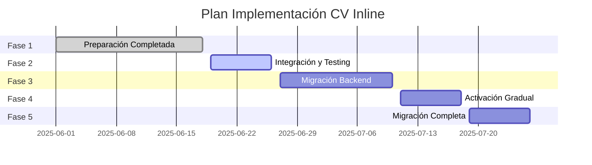

# Plan de Implementación - Sistema CV Inline

## 📋 Resumen Ejecutivo

Este documento describe el plan completo para implementar el nuevo sistema de Curriculum Vitae con componentes inline, reemplazando la implementación actual con una experiencia de usuario moderna y eficiente.

## 🎯 Objetivos

### Objetivos Principales
- **Mejorar UX**: Edición inline sin modales complejos
- **Modernizar Arquitectura**: Componentes reactivos con Angular Signals
- **Optimizar Performance**: Lazy loading y validación en tiempo real
- **Mantener Estabilidad**: Migración gradual sin interrupciones

### Objetivos Técnicos
- Implementar arquitectura hexagonal en frontend
- Usar terminología unificada en inglés
- Aplicar principios SOLID y clean code
- Integrar validación en tiempo real

## 🏗️ Arquitectura Actual vs Nueva

### Estado Actual
```
PerfilComponent
├── PerfilCvComponent (legacy)
    ├── ExperienciaContainerComponent
    ├── EducacionContainerComponent
    └── Modales complejos (4 pasos)
```

### Arquitectura Objetivo
```
PerfilComponent
├── PerfilCvComponent (modernizado)
    ├── ExperienceInlineComponent
    ├── EducationInlineComponent
    └── Edición inline directa
```

## 📅 Plan de Implementación por Fases

### **FASE 1: Preparación y Testing** (1-2 semanas)
**Estado: ✅ COMPLETADO**

#### Tareas Completadas
- [x] Crear componentes inline base
- [x] Implementar servicios CV especializados
- [x] Desarrollar sistema de validación en tiempo real
- [x] Crear modelos unificados (Experience, Education)
- [x] Implementar feature flags
- [x] Verificar compilación exitosa

#### Entregables
- Infraestructura completa de componentes inline
- Servicios CV operativos
- Sistema de migración preparado

---

### **FASE 2: Integración y Testing** (1 semana)

#### 2.1 Crear Ruta de Prueba
**Prioridad: Alta**
```typescript
// Agregar en app.routes.ts
{
  path: 'cv-nuevo',
  loadChildren: () => import('./features/cv/cv.module')
    .then(m => m.CvModule)
}
```

#### 2.2 Configurar Feature Flags
**Prioridad: Alta**
```typescript
// En feature-toggle.service.ts
const CV_FEATURES = {
  useInlineComponents: false,  // Activar gradualmente
  useNewServices: false,       // Activar para testing
  enableRealTimeValidation: false
};
```

#### 2.3 Testing Integral
- [ ] Probar componentes inline en ruta separada
- [ ] Validar integración con backend
- [ ] Verificar performance y UX
- [ ] Testing de regresión

#### Entregables
- Ruta `/dashboard/cv-nuevo` funcional
- Suite de tests completa
- Documentación de testing

---

### **FASE 3: Migración Backend** (1-2 semanas)

#### 3.1 Endpoints CV Unificados
**Prioridad: Alta**
```java
// Crear endpoints con terminología en inglés
@RestController
@RequestMapping("/api/cv")
public class CvController {
    
    @GetMapping("/experiences/user/{userId}")
    public ResponseEntity<List<ExperienceResponse>> getUserExperiences(@PathVariable String userId);
    
    @GetMapping("/education/user/{userId}")
    public ResponseEntity<List<EducationResponse>> getUserEducation(@PathVariable String userId);
}
```

#### 3.2 Servicios Backend
- [ ] Crear `ExperienceService` unificado
- [ ] Crear `EducationService` unificado
- [ ] Implementar validaciones backend
- [ ] Migrar datos existentes

#### 3.3 DTOs y Mappers
- [ ] Crear DTOs con terminología en inglés
- [ ] Implementar mappers legacy → nuevo formato
- [ ] Mantener compatibilidad con APIs existentes

#### Entregables
- APIs CV unificadas operativas
- Migración de datos completada
- Documentación de APIs

---

### **FASE 4: Activación Gradual** (1 semana)

#### 4.1 Testing con Usuarios Específicos
**Prioridad: Alta**
```typescript
// Activar para usuarios específicos
const PILOT_USERS = ['admin', 'user_test'];
const shouldUseCvInline = (userId: string) => 
  PILOT_USERS.includes(userId) || this.featureToggle.isEnabled('cv_inline_pilot');
```

#### 4.2 Monitoreo y Feedback
- [ ] Implementar logging detallado
- [ ] Crear dashboard de métricas
- [ ] Recopilar feedback de usuarios piloto
- [ ] Ajustar basado en feedback

#### 4.3 Optimizaciones
- [ ] Optimizar performance basado en métricas
- [ ] Ajustar UX basado en feedback
- [ ] Resolver issues identificados

#### Entregables
- Sistema funcionando para usuarios piloto
- Métricas de performance
- Plan de optimizaciones

---

### **FASE 5: Migración Completa** (1 semana)

#### 5.1 Reemplazo de PerfilCvComponent
**Prioridad: Crítica**
```typescript
// Reemplazar implementación en perfil-cv.component.ts
@Component({
  selector: 'app-perfil-cv',
  template: `
    <div class="cv-modern-container">
      <app-experience-inline 
        *ngFor="let exp of experiences()" 
        [experience]="exp">
      </app-experience-inline>
      
      <app-education-inline 
        *ngFor="let edu of education()" 
        [education]="edu">
      </app-education-inline>
    </div>
  `
})
```

#### 5.2 Cleanup Legacy
- [ ] Remover componentes legacy
- [ ] Limpiar imports no utilizados
- [ ] Actualizar documentación
- [ ] Remover feature flags temporales

#### 5.3 Validación Final
- [ ] Testing completo en producción
- [ ] Verificar todas las funcionalidades
- [ ] Confirmar performance
- [ ] Validar con usuarios

#### Entregables
- Sistema CV inline completamente implementado
- Código legacy removido
- Documentación actualizada

## 🔧 Consideraciones Técnicas

### Compatibilidad con Backend
```typescript
// Mapper para mantener compatibilidad
export class LegacyCompatibilityMapper {
  static toExperienceRequest(experience: Experience): ExperienciaRequest {
    return {
      puesto: experience.position,
      empresa: experience.company,
      fechaInicio: experience.startDate,
      fechaFin: experience.endDate,
      descripcion: experience.description
    };
  }
}
```

### Gestión de Estado
```typescript
// Estado centralizado con signals
@Injectable()
export class CvStateService {
  private cvData = signal<CvData>({ experiences: [], education: [] });
  
  readonly experiences = computed(() => this.cvData().experiences);
  readonly education = computed(() => this.cvData().education);
}
```

### Validación en Tiempo Real
```typescript
// Validación reactiva
@Component({})
export class ExperienceInlineComponent {
  private validationErrors = signal<ValidationErrors>({});
  
  validateField(field: string, value: any) {
    const errors = CvValidators.validateExperienceField(field, value);
    this.validationErrors.update(current => ({ ...current, [field]: errors }));
  }
}
```

## 📊 Métricas de Éxito

### Métricas Técnicas
- **Performance**: Tiempo de carga < 2s
- **Bundle Size**: Reducción del 20% vs implementación actual
- **Errores**: < 1% error rate en producción

### Métricas de Usuario
- **UX**: Reducción del 50% en pasos para editar CV
- **Adopción**: 90% de usuarios usando nueva funcionalidad
- **Satisfacción**: Score > 4.5/5 en feedback

## ⚠️ Riesgos y Mitigaciones

### Riesgos Identificados
1. **Incompatibilidad Backend**: APIs legacy no funcionan
   - **Mitigación**: Mantener mappers de compatibilidad

2. **Performance Issues**: Componentes inline lentos
   - **Mitigación**: Lazy loading y optimización

3. **Resistencia al Cambio**: Usuarios prefieren sistema actual
   - **Mitigación**: Migración gradual y training

### Plan de Rollback
```typescript
// Feature flag para rollback inmediato
const EMERGENCY_ROLLBACK = {
  useLegacyCv: false,  // Cambiar a true para rollback
  disableInlineComponents: false
};
```

## 📚 Recursos Necesarios

### Equipo
- **1 Developer Senior**: Implementación y arquitectura
- **1 QA**: Testing y validación
- **1 UX Designer**: Refinamiento de experiencia

### Tiempo Estimado
- **Total**: 5-7 semanas
- **Desarrollo**: 4-5 semanas
- **Testing**: 1-2 semanas
- **Deployment**: 1 semana

### Herramientas
- Angular 17+ con Signals
- RxJS para manejo de estado
- Jest para testing
- Cypress para E2E testing

## 🎯 Próximos Pasos Inmediatos

### Esta Semana
1. [ ] Crear ruta de prueba `/dashboard/cv-nuevo`
2. [ ] Configurar feature flags iniciales
3. [ ] Implementar logging y métricas

### Próxima Semana
1. [ ] Testing integral de componentes inline
2. [ ] Validar integración con backend actual
3. [ ] Preparar plan de migración backend

### Mes Siguiente
1. [ ] Implementar migración gradual
2. [ ] Recopilar feedback de usuarios piloto
3. [ ] Ejecutar migración completa

## 📋 Checklist de Implementación

### Fase 1: Preparación ✅
- [x] Componentes inline base creados
- [x] Servicios CV implementados
- [x] Sistema de validación en tiempo real
- [x] Modelos unificados (Experience, Education)
- [x] Feature flags configurados
- [x] Compilación exitosa verificada

### Fase 2: Integración y Testing
- [ ] Crear ruta `/dashboard/cv-nuevo`
- [ ] Configurar feature flags para testing
- [ ] Implementar logging y métricas
- [ ] Testing integral de componentes
- [ ] Validar integración backend
- [ ] Testing de performance y UX

### Fase 3: Migración Backend
- [ ] Crear endpoints CV unificados
- [ ] Implementar servicios backend
- [ ] Crear DTOs con terminología inglés
- [ ] Migrar datos existentes
- [ ] Mantener compatibilidad APIs legacy

### Fase 4: Activación Gradual
- [ ] Testing con usuarios piloto
- [ ] Implementar monitoreo detallado
- [ ] Recopilar feedback usuarios
- [ ] Optimizar basado en métricas
- [ ] Resolver issues identificados

### Fase 5: Migración Completa
- [ ] Reemplazar PerfilCvComponent
- [ ] Cleanup código legacy
- [ ] Remover feature flags temporales
- [ ] Validación final en producción
- [ ] Actualizar documentación

## 🔄 Comandos de Implementación

### Crear Ruta de Prueba
```bash
# 1. Agregar ruta en app.routes.ts
ng generate component features/cv/cv-test-page

# 2. Configurar lazy loading
# En app.routes.ts agregar:
{
  path: 'cv-nuevo',
  loadChildren: () => import('./features/cv/cv.module').then(m => m.CvModule)
}
```

### Activar Feature Flags
```typescript
// En feature-toggle.service.ts
updateFeatureFlags({
  cvInlineComponents: true,
  cvNewServices: true,
  cvRealTimeValidation: true
});
```

### Testing Commands
```bash
# Testing unitario
npm run test:cv

# Testing E2E
npm run e2e:cv

# Build y verificación
npm run build:prod
```

## 📞 Contactos y Responsabilidades

### Equipo de Desarrollo
- **Lead Developer**: Implementación arquitectura y componentes core
- **Frontend Developer**: Componentes UI y integración
- **Backend Developer**: APIs y migración de datos
- **QA Engineer**: Testing y validación

### Stakeholders
- **Product Owner**: Validación de requisitos y UX
- **DevOps**: Deployment y monitoreo
- **Support Team**: Training y documentación usuario

## 📈 Timeline Detallado



---

**Documento creado**: 2025-06-18
**Última actualización**: 2025-06-18
**Versión**: 1.0
**Estado**: Fase 1 Completada ✅

**Próxima Revisión**: 2025-06-25
**Responsable**: Equipo de Desarrollo MPD Concursos
