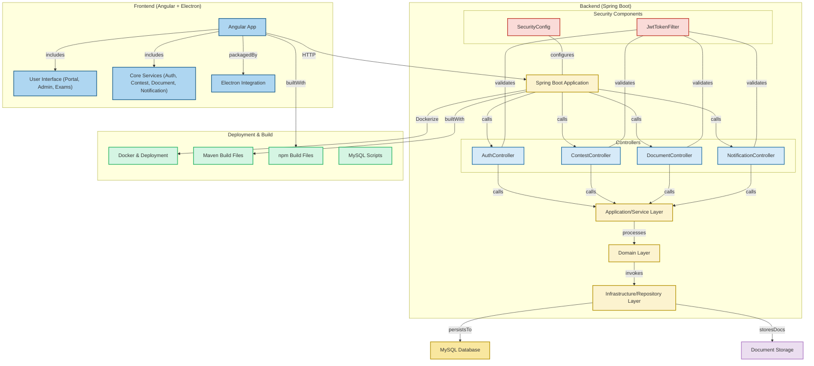

# Defensa Mendoza - Sistema de Concursos

Sistema de gestión de concursos para el Ministerio Público de la Defensa de Mendoza. Esta plataforma permite la gestión integral del proceso de concursos, desde la publicación hasta la evaluación y selección de candidatos.

## 🚀 Características Principales

- **Gestión de Concursos**: Publicación, seguimiento y administración de concursos públicos
- **Portal del Postulante**: Interfaz intuitiva para la inscripción y seguimiento de postulaciones
- **Gestión Documental**: Sistema de carga y validación de documentación requerida
- **Panel Administrativo**: Herramientas completas para la gestión del proceso
- **Sistema de Notificaciones**: Alertas y comunicaciones automáticas
- **Seguimiento de Estados**: Control del progreso de cada concurso y postulación

## 🛠️ Tecnologías Utilizadas

### Frontend
- Angular
- Material Design
- SCSS
- TypeScript
- Electron (para versión de escritorio)

### Backend
- Spring Boot
- Java 17
- MySQL
- JWT para autenticación
- Maven

## 📦 Estructura del Proyecto

```
├── concurso-backend/           # Backend en Spring Boot
│   ├── src/                    
│   │   ├── main/              
│   │   │   ├── java/          # Código fuente Java
│   │   │   └── resources/     # Configuraciones
│   │   └── test/              # Tests
│   └── pom.xml                # Dependencias Maven
│
└── mpd-concursos-app-frontend/ # Frontend en Angular
    ├── src/
    │   ├── app/               # Código fuente Angular
    │   ├── assets/            # Recursos estáticos
    │   └── environments/      # Configuraciones por ambiente
    ├── electron/              # Configuración Electron
    └── package.json           # Dependencias npm
```

## 🏗️ Arquitectura del Sistema



## 🚀 Instalación y Configuración

### Requisitos Previos
- Java 17 o superior
- Node.js 18 o superior
- MySQL 8.0
- Maven 3.8+

### Backend
1. Configurar variables de entorno:
   ```properties
   DB_HOST=localhost
   DB_PORT=3306
   DB_NAME=mpd_concursos
   DB_USERNAME=your_username
   DB_PASSWORD=your_password
   JWT_SECRET=your_secret
   ```

2. Ejecutar:
   ```bash
   cd concurso-backend
   mvn clean install
   mvn spring-boot:run
   ```

### Frontend
1. Instalar dependencias:
   ```bash
   cd mpd-concursos-app-frontend
   npm install
   ```

2. Ejecutar en modo desarrollo:
   ```bash
   npm run start
   ```

3. Para compilar versión de escritorio:
   ```bash
   npm run electron:build
   ```

## 🔐 Seguridad

- Autenticación mediante JWT
- Roles y permisos granulares
- Encriptación de datos sensibles
- Validación de documentos
- Control de sesiones

## 👥 Roles del Sistema

- **Administrador**: Gestión completa del sistema
- **Evaluador**: Revisión de postulaciones y documentación
- **Postulante**: Inscripción y seguimiento de concursos
- **Auditor**: Monitoreo y reportes del sistema

## 📄 Licencia

Este proyecto es propiedad del Ministerio Público de la Defensa de Mendoza.

## 🤝 Contacto

Para soporte o consultas, contactar al equipo de desarrollo del Ministerio Público de la Defensa de Mendoza. 