# Defensa Mendoza - Sistema de Concursos

Sistema de gestión de concursos para el Ministerio Público de la Defensa de Mendoza. Esta plataforma permite la gestión integral del proceso de concursos, desde la publicación hasta la evaluación y selección de candidatos.

## 🚀 Características Principales

- **Gestión de Concursos**: Publicación, seguimiento y administración de concursos públicos
- **Portal del Postulante**: Interfaz intuitiva para la inscripción y seguimiento de postulaciones
- **Gestión Documental**: Sistema de carga y validación de documentación requerida
- **Panel Administrativo**: Herramientas completas para la gestión del proceso
- **Sistema de Notificaciones**: Alertas y comunicaciones automáticas
- **Seguimiento de Estados**: Control del progreso de cada concurso y postulación

## 🛠️ Tecnologías Utilizadas

### Frontend
- Angular
- Material Design
- SCSS
- TypeScript
- Electron (para versión de escritorio)

### Backend
- Spring Boot
- Java 17
- MySQL
- JWT para autenticación
- Maven

## 📦 Estructura del Proyecto

```
├── concurso-backend/           # Backend en Spring Boot
│   ├── src/                    
│   │   ├── main/              
│   │   │   ├── java/          # Código fuente Java
│   │   │   └── resources/     # Configuraciones
│   │   └── test/              # Tests
│   └── pom.xml                # Dependencias Maven
│
└── mpd-concursos-app-frontend/ # Frontend en Angular
    ├── src/
    │   ├── app/               # Código fuente Angular
    │   ├── assets/            # Recursos estáticos
    │   └── environments/      # Configuraciones por ambiente
    ├── electron/              # Configuración Electron
    └── package.json           # Dependencias npm
```

## 🏗️ Arquitectura del Sistema

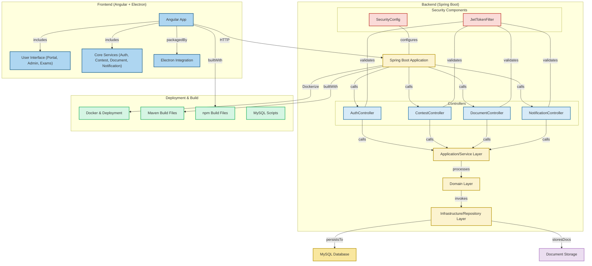

## 🚀 Instalación y Configuración

### Requisitos Previos
- Java 17 o superior
- Node.js 18 o superior
- MySQL 8.0
- Maven 3.8+

### Backend
1. Configurar variables de entorno:
   ```properties
   DB_HOST=localhost
   DB_PORT=3306
   DB_NAME=mpd_concursos
   DB_USERNAME=your_username
   DB_PASSWORD=your_password
   JWT_SECRET=your_secret
   ```

2. Ejecutar:
   ```bash
   cd concurso-backend
   mvn clean install
   mvn spring-boot:run
   ```

### Frontend
1. Instalar dependencias:
   ```bash
   cd mpd-concursos-app-frontend
   npm install
   ```

2. Ejecutar en modo desarrollo:
   ```bash
   npm run start
   ```

3. Para compilar versión de escritorio:
   ```bash
   npm run electron:build
   ```

## 🔐 Seguridad

- Autenticación mediante JWT
- Roles y permisos granulares
- Encriptación de datos sensibles
- Validación de documentos
- Control de sesiones

## 👥 Roles del Sistema

- **Administrador**: Gestión completa del sistema
- **Evaluador**: Revisión de postulaciones y documentación
- **Postulante**: Inscripción y seguimiento de concursos
- **Auditor**: Monitoreo y reportes del sistema

## 📄 Licencia

Este proyecto es propiedad del Ministerio Público de la Defensa de Mendoza.

## 🤝 Contacto

Para soporte o consultas, contactar al equipo de desarrollo del Ministerio Público de la Defensa de Mendoza.

## 📊 Flujos de Datos Principales

### 1. Proceso de Postulación
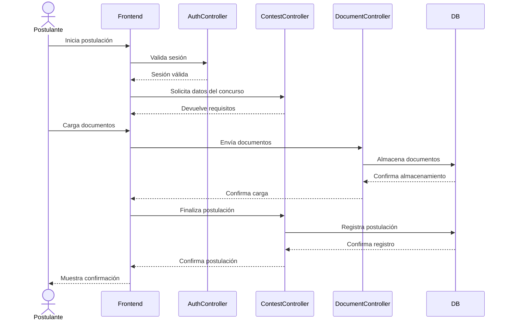

### 2. Proceso de Evaluación
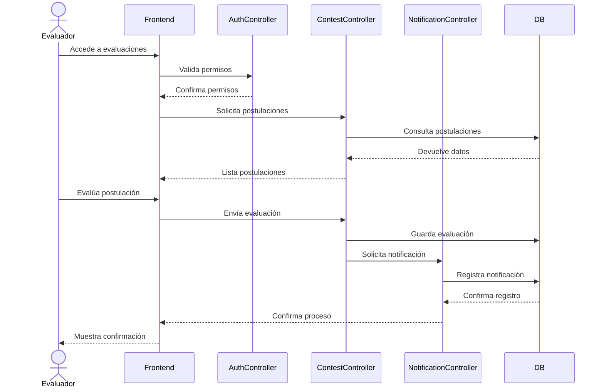

## 📱 Ejemplos de Uso

### 1. Creación de un Nuevo Concurso
```typescript
// Ejemplo de payload para crear un concurso
const nuevoConcurso = {
  titulo: "Defensor/a Penal - Primera C.J.",
  descripcion: "Concurso para cargo de Defensor Penal",
  fechaInicio: "2024-03-28T00:00:00Z",
  fechaFin: "2024-04-28T23:59:59Z",
  requisitos: [
    "Título de Abogado",
    "5 años de experiencia",
    "Matrícula activa"
  ],
  documentosRequeridos: [
    {
      tipo: "TITULO_GRADO",
      descripcion: "Título de Abogado",
      obligatorio: true
    },
    {
      tipo: "CURRICULUM",
      descripcion: "Curriculum Vitae actualizado",
      obligatorio: true
    }
  ],
  cargo: {
    nombre: "Defensor Penal",
    categoria: "Primera",
    circunscripcion: "Primera"
  }
};
```

### 2. Gestión de Documentos
```java
@PostMapping("/documentos")
public ResponseEntity<DocumentoResponse> cargarDocumento(
    @RequestParam("archivo") MultipartFile archivo,
    @RequestParam("tipo") TipoDocumento tipo,
    @RequestParam("postulacionId") Long postulacionId
) {
    try {
        // Validación de formato y tamaño
        validarDocumento(archivo);
        
        // Procesamiento y almacenamiento
        String rutaArchivo = documentoService.almacenar(archivo);
        
        // Registro en base de datos
        Documento documento = documentoService.registrar(
            Documento.builder()
                .tipo(tipo)
                .ruta(rutaArchivo)
                .postulacionId(postulacionId)
                .estado(EstadoDocumento.PENDIENTE_REVISION)
                .build()
        );
        
        return ResponseEntity.ok(documentoMapper.toResponse(documento));
    } catch (Exception e) {
        log.error("Error al procesar documento", e);
        return ResponseEntity.status(HttpStatus.INTERNAL_SERVER_ERROR).build();
    }
}
```

## 🔄 Ciclo de Vida de un Concurso

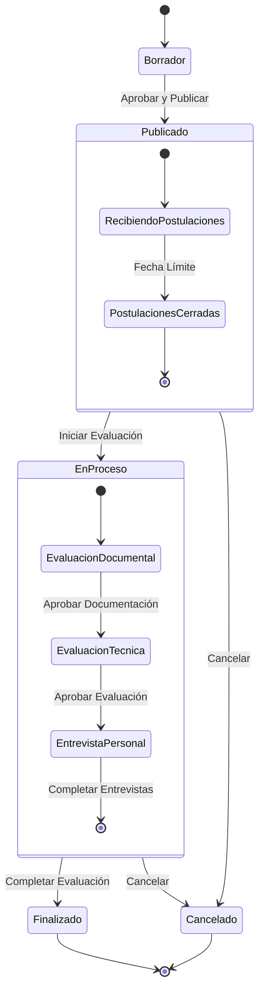

## 🔐 Detalles de Seguridad

### Estructura de JWT
```json
{
  "header": {
    "alg": "HS256",
    "typ": "JWT"
  },
  "payload": {
    "sub": "1234567890",
    "name": "Juan Pérez",
    "roles": ["ROLE_POSTULANTE"],
    "permisos": [
      "ver_concursos",
      "postular_concursos",
      "ver_documentos"
    ],
    "iat": 1516239022,
    "exp": 1516242622
  }
}
```

### Niveles de Acceso
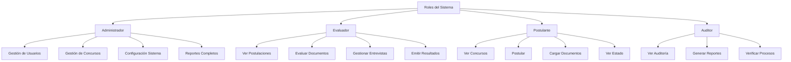

## 📊 Modelo de Base de Datos

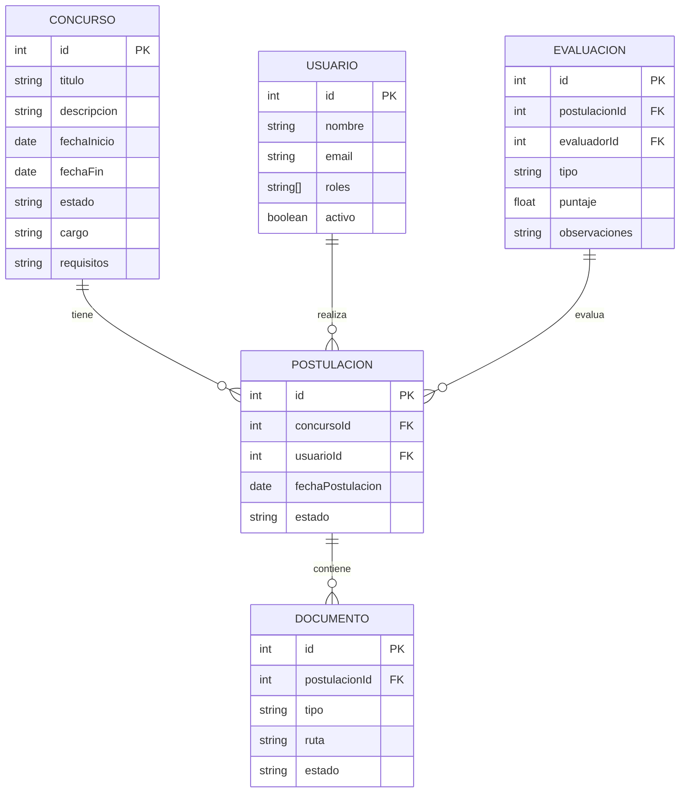

## 🔄 Flujos de Datos Detallados

### Autenticación y Autorización
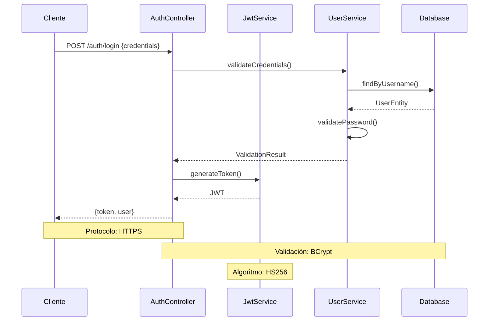

### Gestión de Documentos
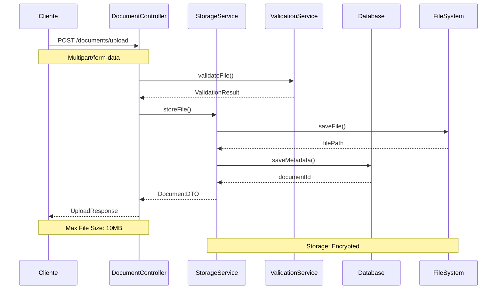

## 🧩 Componentes Internos

### Frontend Modules
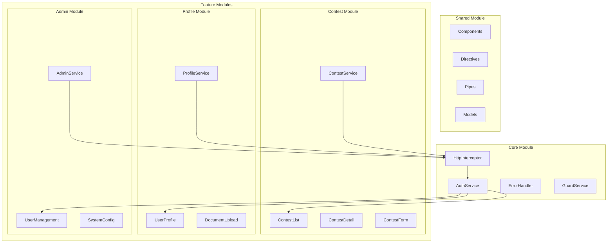

### Backend Components
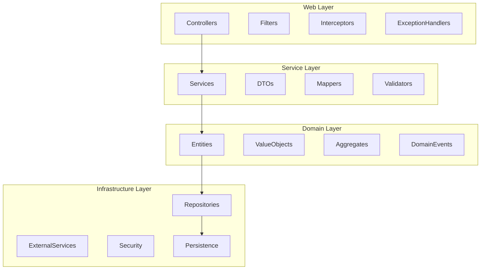

## 🔌 Interfaces y Protocolos

### API Endpoints
```yaml
auth:
  login:
    path: /api/auth/login
    method: POST
    content-type: application/json
    body: {username: string, password: string}
    response: {token: string, user: UserDTO}

contests:
  list:
    path: /api/contests
    method: GET
    headers: {Authorization: Bearer token}
    query-params: {
      status: string,
      page: number,
      size: number,
      sort: string
    }
    response: {
      content: Contest[],
      totalElements: number,
      totalPages: number
    }

documents:
  upload:
    path: /api/documents/upload
    method: POST
    headers: {
      Authorization: Bearer token,
      Content-Type: multipart/form-data
    }
    body: FormData
    response: {
      documentId: string,
      url: string,
      status: string
    }
```

### Protocolos de Comunicación
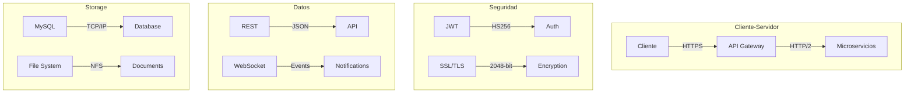

### Interfaces de Servicios
```typescript
interface IAuthService {
    login(credentials: LoginDTO): Promise<AuthResponse>;
    logout(): Promise<void>;
    refreshToken(): Promise<string>;
    validateToken(token: string): boolean;
}

interface IContestService {
    create(contest: ContestDTO): Promise<Contest>;
    update(id: string, contest: ContestDTO): Promise<Contest>;
    delete(id: string): Promise<void>;
    findById(id: string): Promise<Contest>;
    findAll(params: FilterParams): Promise<PagedResponse<Contest>>;
}

interface IDocumentService {
    upload(file: File, metadata: DocumentMetadata): Promise<Document>;
    download(id: string): Promise<Blob>;
    validate(document: Document): Promise<ValidationResult>;
    delete(id: string): Promise<void>;
}

interface INotificationService {
    send(notification: NotificationDTO): Promise<void>;
    subscribe(userId: string): Observable<Notification>;
    markAsRead(notificationId: string): Promise<void>;
    getUnreadCount(): Promise<number>;
}
``` 