# Defensa Mendoza - Sistema de Concursos

Sistema de gestión de concursos para el Ministerio Público de la Defensa de Mendoza. Esta plataforma permite la gestión integral del proceso de concursos, desde la publicación hasta la evaluación y selección de candidatos.

## 🚀 Características Principales

- **Gestión de Concursos**: Publicación, seguimiento y administración de concursos públicos
- **Portal del Postulante**: Interfaz intuitiva para la inscripción y seguimiento de postulaciones
- **Gestión Documental**: Sistema de carga y validación de documentación requerida
- **Panel Administrativo**: Herramientas completas para la gestión del proceso
- **Sistema de Notificaciones**: Alertas y comunicaciones automáticas
- **Seguimiento de Estados**: Control del progreso de cada concurso y postulación
- **Máquinas de Estado**: Validación centralizada de transiciones de estado con reglas de negocio
- **🆕 Sistema CV Avanzado**: Funcionalidades avanzadas para gestión de currículum vitae
  - Búsqueda inteligente con filtros avanzados
  - Exportación a PDF con múltiples plantillas
  - Drag & drop para reordenamiento
  - Autocompletado inteligente

## 🛠️ Tecnologías Utilizadas

### Frontend
- Angular 18
- **Glassmorphism Design System** (Material UI eliminado del área de usuario)
- **Componentes Custom** standalone sin dependencias pesadas
- TailwindCSS
- TypeScript
- RxJS para programación reactiva
- JWT para autenticación
- Electron (para versión de escritorio)
- **🆕 Funcionalidades CV Avanzadas**:
  - Fuse.js para búsqueda fuzzy
  - jsPDF para exportación PDF
  - html2canvas para captura de elementos
  - Angular CDK Drag & Drop
- **🆕 Funcionalidades CV Avanzadas**:
  - Fuse.js para búsqueda fuzzy
  - jsPDF para exportación PDF
  - html2canvas para captura de elementos
  - Angular CDK Drag & Drop

### Backend
- Spring Boot 3.2.4
- Java 21
- Arquitectura Hexagonal (Ports & Adapters)
- MySQL 8.0
- Spring Security con JWT para autenticación
- Spring Data JPA + Hibernate
- Lombok y MapStruct
- Maven

## 📦 Estructura del Proyecto

```
├── concurso-backend/           # Backend en Spring Boot
│   ├── src/
│   │   ├── main/
│   │   │   ├── java/          # Código fuente Java
│   │   │   └── resources/     # Configuraciones
│   │   └── test/              # Tests
│   └── pom.xml                # Dependencias Maven
│
└── mpd-concursos-app-frontend/ # Frontend en Angular
    ├── src/
    │   ├── app/               # Código fuente Angular
    │   ├── assets/            # Recursos estáticos
    │   └── environments/      # Configuraciones por ambiente
    ├── build/                 # Archivos de build
    └── package.json           # Dependencias npm
```

## 🏗️ Arquitectura del Sistema

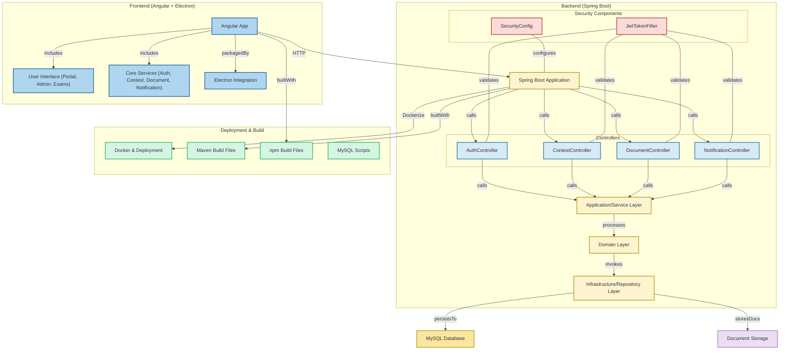
```mermaid
flowchart TD

    %% Frontend Subgraph
    subgraph "Frontend (Angular + Electron)"
        F1["Angular App"]:::frontend
        F2["User Interface (Portal, Admin, Exams)"]:::frontend
        F3["Core Services (Auth, Contest, Document, Notification)"]:::frontend
        F4["Electron Integration"]:::frontend
    end

    %% Backend Subgraph
    subgraph "Backend (Spring Boot)"
        B0["Spring Boot Application"]:::backend
        subgraph "Controllers"
            BC1["AuthController"]:::controller
            BC2["ContestController"]:::controller
            BC3["DocumentController"]:::controller
            BC4["NotificationController"]:::controller
        end
        B2["Application/Service Layer"]:::backend
        B3["Domain Layer"]:::backend
        B4["Infrastructure/Repository Layer"]:::backend
        subgraph "Security Components"
            S1["JwtTokenFilter"]:::security
            S2["SecurityConfig"]:::security
        end
    end

    %% Database and Document Storage
    DB["MySQL Database"]:::database
    DS["Document Storage"]:::doc

    %% Deployment & Build Subgraph
    subgraph "Deployment & Build"
        D1["Docker & Deployment"]:::deploy
        D2["Maven Build Files"]:::deploy
        D3["npm Build Files"]:::deploy
        DScr["MySQL Scripts"]:::deploy
    end

    %% Connections for Frontend
    F1 -->|"includes"| F2
    F1 -->|"includes"| F3
    F1 -->|"packagedBy"| F4
    F1 -->|"HTTP"| B0

    %% Backend internal flow
    B0 -->|"calls"| BC1
    B0 -->|"calls"| BC2
    B0 -->|"calls"| BC3
    B0 -->|"calls"| BC4
    BC1 -->|"calls"| B2
    BC2 -->|"calls"| B2
    BC3 -->|"calls"| B2
    BC4 -->|"calls"| B2
    B2 -->|"processes"| B3
    B3 -->|"invokes"| B4
    B4 -->|"persistsTo"| DB
    B4 -->|"storesDocs"| DS

    %% Security flow
    S1 ---|"validates"| BC1
    S1 ---|"validates"| BC2
    S1 ---|"validates"| BC3
    S1 ---|"validates"| BC4
    S2 ---|"configures"| B0

    %% Deployment & Build connections
    B0 -->|"Dockerize"| D1
    B0 -->|"builtWith"| D2
    F1 -->|"builtWith"| D3

    %% Styles
    classDef frontend fill:#AED6F1,stroke:#1F618D,stroke-width:2px;
    classDef backend fill:#FCF3CF,stroke:#B7950B,stroke-width:2px;
    classDef controller fill:#D6EAF8,stroke:#2874A6,stroke-width:2px;
    classDef security fill:#FADBD8,stroke:#C0392B,stroke-width:2px;
    classDef database fill:#F9E79F,stroke:#B7950B,stroke-width:2px;
    classDef doc fill:#EBDEF0,stroke:#AF7AC5,stroke-width:2px;
    classDef deploy fill:#D5F5E3,stroke:#28B463,stroke-width:2px;
```

## 🔄 Sistema de Máquinas de Estado

El sistema implementa máquinas de estado centralizadas para garantizar la consistencia y validación de transiciones en todos los procesos críticos.

### Máquina de Estado de Concursos

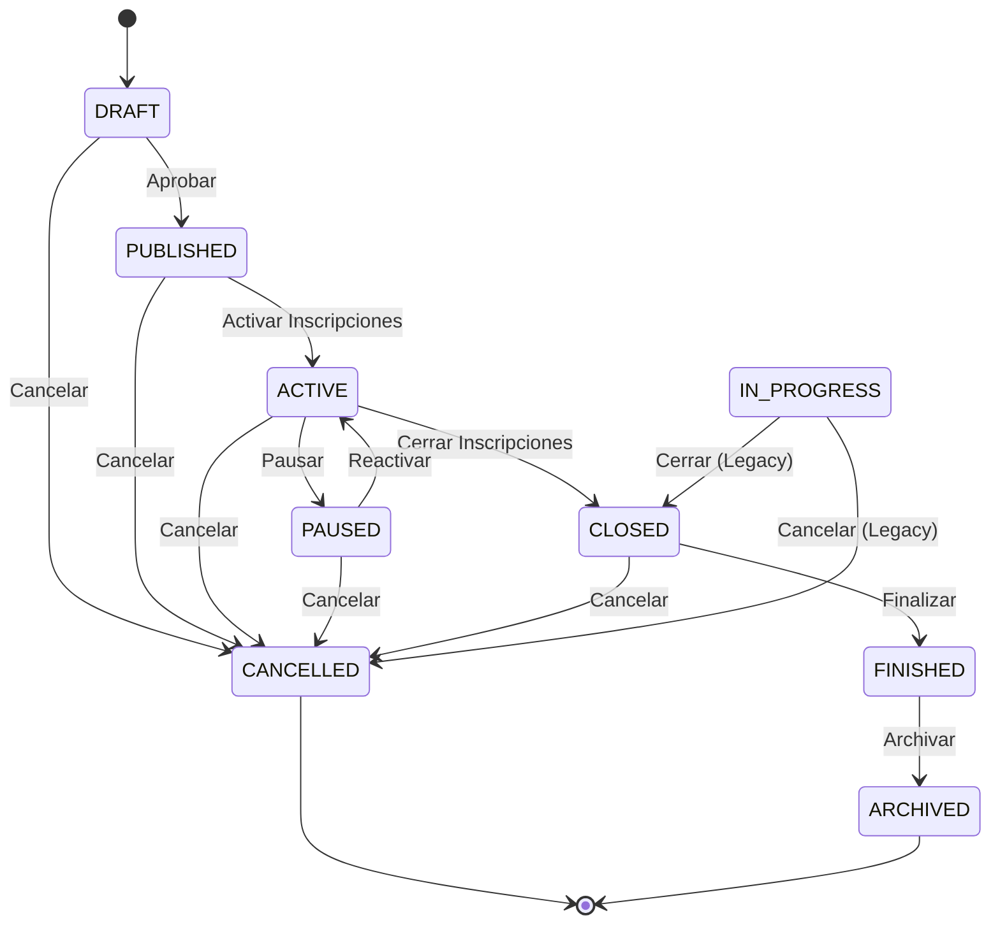
```mermaid
stateDiagram-v2
    [*] --> DRAFT
    DRAFT --> PUBLISHED: Aprobar
    DRAFT --> CANCELLED: Cancelar
    PUBLISHED --> ACTIVE: Activar Inscripciones
    PUBLISHED --> CANCELLED: Cancelar
    ACTIVE --> PAUSED: Pausar
    ACTIVE --> CLOSED: Cerrar Inscripciones
    ACTIVE --> CANCELLED: Cancelar
    PAUSED --> ACTIVE: Reactivar
    PAUSED --> CANCELLED: Cancelar
    CLOSED --> FINISHED: Finalizar
    CLOSED --> CANCELLED: Cancelar
    FINISHED --> ARCHIVED: Archivar
    IN_PROGRESS --> CLOSED: Cerrar (Legacy)
    IN_PROGRESS --> CANCELLED: Cancelar (Legacy)
    CANCELLED --> [*]
    ARCHIVED --> [*]
```

### Máquina de Estado de Inscripciones

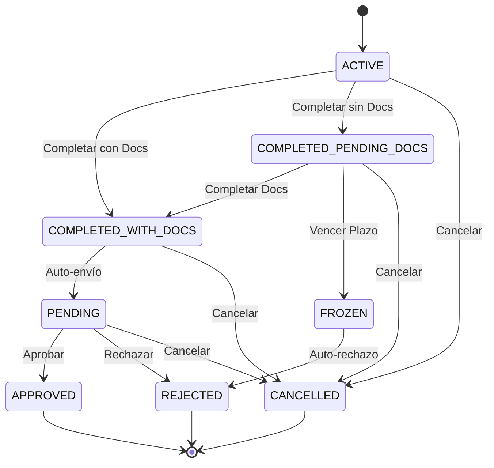
```mermaid
stateDiagram-v2
    [*] --> ACTIVE
    ACTIVE --> COMPLETED_WITH_DOCS: Completar con Docs
    ACTIVE --> COMPLETED_PENDING_DOCS: Completar sin Docs
    ACTIVE --> CANCELLED: Cancelar
    COMPLETED_WITH_DOCS --> PENDING: Auto-envío
    COMPLETED_WITH_DOCS --> CANCELLED: Cancelar
    COMPLETED_PENDING_DOCS --> COMPLETED_WITH_DOCS: Completar Docs
    COMPLETED_PENDING_DOCS --> FROZEN: Vencer Plazo
    COMPLETED_PENDING_DOCS --> CANCELLED: Cancelar
    PENDING --> APPROVED: Aprobar
    PENDING --> REJECTED: Rechazar
    PENDING --> CANCELLED: Cancelar
    FROZEN --> REJECTED: Auto-rechazo
    APPROVED --> [*]
    REJECTED --> [*]
    CANCELLED --> [*]
```

### Características de las Máquinas de Estado

- **Validación Centralizada**: Todas las transiciones son validadas por las máquinas de estado
- **Reglas de Negocio**: Cada estado tiene reglas específicas documentadas
- **Transiciones Automáticas**: Algunos estados se transicionan automáticamente según condiciones
- **Estados Legacy**: Soporte para estados heredados del sistema anterior
- **API Endpoints**: Exposición de estados válidos y validaciones vía REST API

### Beneficios

- ✅ **Consistencia**: Garantiza que todas las transiciones sigan las reglas de negocio
- ✅ **Mantenibilidad**: Centraliza la lógica de estados en componentes reutilizables
- ✅ **Testabilidad**: Permite testing unitario de todas las transiciones
- ✅ **Documentación**: Auto-documenta las reglas de negocio en código
- ✅ **Extensibilidad**: Facilita agregar nuevos estados y transiciones

## 🎊 Estado Actual del Proyecto - Enero 2025

### ✅ Refactorización CV - Fase 1 Completada (Enero 2025)

Se ha implementado exitosamente la **Fase 1** del plan de refactorización incremental para la funcionalidad de Currículum Vitae:

#### 📋 Elementos Implementados

1. **Modelos Estandarizados** (`src/app/core/models/cv/`)
   - ✅ Interfaces TypeScript con terminología en inglés consistente
   - ✅ Compatibilidad hacia atrás con modelos legacy (ExperienciaData, EducacionData)
   - ✅ Separación clara entre modelos de dominio, DTOs y formularios
   - ✅ Enums para tipos de educación y actividades científicas

2. **Validadores Frontend Robustos** (`src/app/core/validators/`)
   - ✅ Protección XSS mediante validación de contenido peligroso
   - ✅ Validaciones de negocio específicas para CV (fechas, rangos, formatos)
   - ✅ Sanitización automática de contenido HTML
   - ✅ Tests unitarios con 100% de cobertura

3. **Sistema de Feature Flags** (`src/app/core/services/`)
   - ✅ Migración gradual desde servicios mock hacia servicios reales
   - ✅ Gestión de dependencias entre features
   - ✅ Persistencia en localStorage para configuración por usuario
   - ✅ Rollback capability para revertir cambios problemáticos

4. **Mappers de Conversión** (`src/app/core/mappers/`)
   - ✅ Conversión segura entre modelos legacy y nuevos
   - ✅ Mapeo de respuestas API a modelos de dominio
   - ✅ Tests unitarios completos

#### ✅ Fase 2 Completada - Servicios Reales y Conectividad Backend

- ✅ **Servicios CV Reales**: ExperienceCvService y EducationCvService conectados al backend
- ✅ **Gestión de Estado Centralizada**: CvStateService para coordinación de datos
- ✅ **Interceptores HTTP Especializados**: Manejo de errores, retry logic y caching para CV
- ✅ **Sistema de Migración Gradual**: CvMigrationService para transición segura legacy→nuevo
- ✅ **Componente de Demostración**: UI para testing y validación de migración

#### 🎯 Próximos Pasos (Fase 3)

- [ ] Crear componentes de edición inline para experiencias y educación
- [ ] Implementar validación en tiempo real con feedback visual
- [ ] Configurar lazy loading para optimizar rendimiento
- [ ] Migrar componentes existentes para usar nuevos modelos

#### 📚 Documentación

- [Core CV Module README](mpd-concursos-app-frontend/src/app/core/README.md)
- [Plan de Refactorización Completo](docs/cv-refactoring-plan.md)
- [Auditoría Técnica CV](docs/cv-technical-audit.md)

### ✅ Correcciones Críticas Implementadas (Diciembre 2024)

#### 🔧 Error "No se recibió el ID de inscripción" - SOLUCIONADO
- **Flujo de navegación corregido** para crear inscripción antes de navegar al proceso
- **Estados de finalización mejorados** con diferenciación entre `COMPLETED_WITH_DOCS` y `COMPLETED_PENDING_DOCS`
- **Detección de inscripciones existentes** implementada en cards de concursos
- **Cache de inscripciones actualizado** automáticamente después de crear inscripciones

#### 🎯 Mejoras en el Sistema de Estados
- **Estados correctos** según documentación: "Documentos Pendientes" en lugar de "Pendiente" genérico
- **Botones inteligentes** que detectan inscripciones existentes y cambian a "Ver Postulación" o "Continuar"
- **Sincronización mejorada** entre frontend y backend para estados de inscripción

### ✅ Pasos Recomendados Completados

El proyecto ha completado exitosamente todos los **pasos recomendados de la Fase 4**, incluyendo:

#### 🏆 Refactoring Glassmorphism 100% Completado
- **Material UI completamente eliminado** del área de usuario común
- **Glassmorphism premium dark** aplicado en todos los componentes
- **Componentes custom standalone** implementados y funcionando
- **Separación admin/usuario** completamente establecida

#### ✅ Sistema Verificado y Funcionando
- **Frontend**: Compilación exitosa, servidor Angular operativo (puerto 4200)
- **Backend**: Spring Boot funcionando correctamente (puerto 8080)
- **Base de datos**: H2 conectada, migraciones ejecutadas
- **Arquitectura**: Hexagonal consolidada en backend, modular en frontend

## ⚠️ Análisis de Migración UUID - Fase 4

### Estado Actual del Análisis

El proyecto ha completado un análisis exhaustivo para la **Fase 4: Migración al Modelo Principal UUID**. Los resultados indican que esta migración requiere un enfoque más gradual debido a su complejidad.

### Resultados del Análisis

#### ✅ Componentes Creados
- **Script de Migración**: `V3__migrate_contests_to_uuid.sql` para migración de base de datos
- **ContestIdAdapter**: Adaptador para conversión bidireccional Long ↔ UUID
- **ContestRepositoryAdapter**: Wrapper para mantener compatibilidad durante migración
- **Documentación Técnica**: Plan detallado de sub-fases para migración gradual

#### ⚠️ Complejidad Detectada
- **50+ archivos** requieren modificación simultánea
- **Incompatibilidades de tipos** Long vs UUID en toda la aplicación
- **APIs públicas** necesitan versionado para mantener compatibilidad
- **Base de datos** requiere migración compleja con potencial downtime

#### 🎯 Recomendaciones Estratégicas
1. **División en Sub-Fases**: Implementar migración en fases 4A-4E
   - **Fase 4A**: Migración de base de datos
   - **Fase 4B**: Actualización de entidades y repositories
   - **Fase 4C**: Migración de servicios de dominio
   - **Fase 4D**: Actualización de APIs y controladores
   - **Fase 4E**: Eliminación de modelos legacy

2. **Versionado de APIs**: Mantener compatibilidad con clientes existentes
3. **Testing Incremental**: Validación exhaustiva en cada sub-fase
4. **Migración Gradual**: Verificación continua y rollback capability

### Archivos de Migración Disponibles

Los siguientes archivos están listos para futuras implementaciones:
- `concurso-backend/src/main/resources/db/migration/V3__migrate_contests_to_uuid.sql`
- `concurso-backend/src/main/java/ar/gov/mpd/concursobackend/contest/infrastructure/adapter/ContestIdAdapter.java`
- `concurso-backend/src/main/java/ar/gov/mpd/concursobackend/contest/infrastructure/adapter/ContestRepositoryAdapter.java`

## 🚀 Instalación y Configuración

### Requisitos Previos
- Java 21
- Node.js 18 o superior
- MySQL 8.0
- Maven 3.8+
- Docker y Docker Compose (para entorno de desarrollo y producción)

## 🌐 Deployment en Producción (Servidor Donweb)

### Especificaciones del Servidor
- **Host**: vps-4778464-x.dattaweb.com
- **IP**: 149.50.132.23
- **Recursos**: 2 vCPUs, 4 GB RAM, 40 GB SSD
- **SO**: Ubuntu 22.04 con Docker
- **Puertos**: 80, 443, 5250, 8090

### Deployment Automático

1. **Clonar el repositorio en el servidor:**
   ```bash
   git clone https://github.com/tu-usuario/concursos-mpd.git
   cd concursos-mpd
   ```

2. **Ejecutar el script de deployment:**
   ```bash
   ./deploy-production.sh
   ```

3. **Verificar el deployment:**
   ```bash
   ./verify-production.sh
   ```

### URLs de Acceso en Producción
- **Frontend**: http://149.50.132.23:8000
- **Backend API**: http://149.50.132.23:8080
- **Health Check**: http://149.50.132.23:8080/actuator/health

### Comandos de Gestión en Producción
```bash
# Ver estado de contenedores
docker-compose -f docker-compose.prod.yml ps

# Ver logs en tiempo real
docker-compose -f docker-compose.prod.yml logs -f

# Reiniciar servicios
docker-compose -f docker-compose.prod.yml restart

# Detener todos los servicios
docker-compose -f docker-compose.prod.yml down

# Actualizar desde repositorio
git pull origin main
docker-compose -f docker-compose.prod.yml build --no-cache
docker-compose -f docker-compose.prod.yml up -d
```

### Backend
1. Configurar variables de entorno:
   ```properties
   DB_HOST=localhost
   DB_PORT=3306
   DB_NAME=mpd_concursos
   DB_USERNAME=your_username
   DB_PASSWORD=your_password
   JWT_SECRET=your_secret
   ```

2. Ejecutar:
   ```bash
   cd concurso-backend
   mvn clean install
   mvn spring-boot:run
   ```

### Frontend
1. Instalar dependencias:
   ```bash
   cd mpd-concursos-app-frontend
   npm install
   ```

2. Ejecutar en modo desarrollo:
   ```bash
   npm run start
   ```

3. Para compilar versión de producción:
   ```bash
   npm run build
   ```

## 🔐 Seguridad

- Autenticación mediante JWT
- Roles y permisos granulares
- Encriptación de datos sensibles
- Validación de documentos
- Control de sesiones

## 👥 Roles del Sistema

- **Administrador**: Gestión completa del sistema
- **Evaluador**: Revisión de postulaciones y documentación
- **Postulante**: Inscripción y seguimiento de concursos
- **Auditor**: Monitoreo y reportes del sistema

## 📄 Licencia

Este proyecto es propiedad del Ministerio Público de la Defensa de Mendoza.

## 🤝 Contacto

Para soporte o consultas, contactar al equipo de desarrollo del Ministerio Público de la Defensa de Mendoza.

## 📊 Flujos de Datos Principales

### 1. Proceso de Postulación
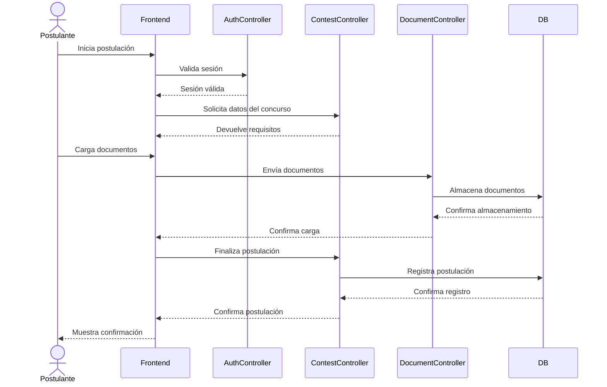
```mermaid
sequenceDiagram
    actor Postulante
    participant Frontend
    participant AuthController
    participant ContestController
    participant DocumentController
    participant DB

    Postulante->>Frontend: Inicia postulación
    Frontend->>AuthController: Valida sesión
    AuthController-->>Frontend: Sesión válida
    Frontend->>ContestController: Solicita datos del concurso
    ContestController-->>Frontend: Devuelve requisitos
    Postulante->>Frontend: Carga documentos
    Frontend->>DocumentController: Envía documentos
    DocumentController->>DB: Almacena documentos
    DB-->>DocumentController: Confirma almacenamiento
    DocumentController-->>Frontend: Confirma carga
    Frontend->>ContestController: Finaliza postulación
    ContestController->>DB: Registra postulación
    DB-->>ContestController: Confirma registro
    ContestController-->>Frontend: Confirma postulación
    Frontend-->>Postulante: Muestra confirmación
```

### 2. Proceso de Evaluación
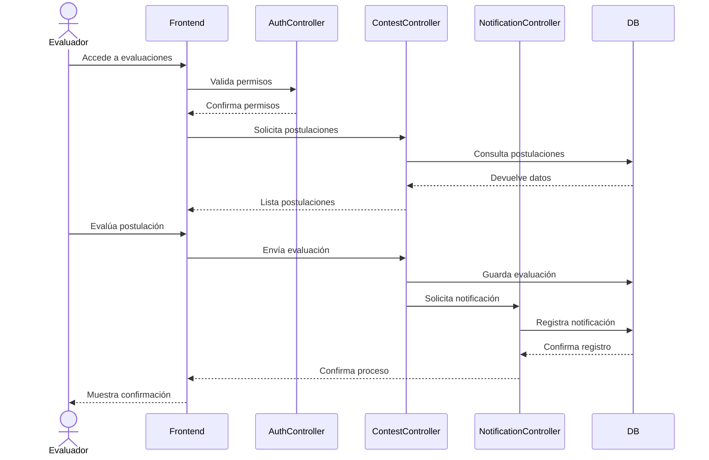
```mermaid
sequenceDiagram
    actor Evaluador
    participant Frontend
    participant AuthController
    participant ContestController
    participant NotificationController
    participant DB

    Evaluador->>Frontend: Accede a evaluaciones
    Frontend->>AuthController: Valida permisos
    AuthController-->>Frontend: Confirma permisos
    Frontend->>ContestController: Solicita postulaciones
    ContestController->>DB: Consulta postulaciones
    DB-->>ContestController: Devuelve datos
    ContestController-->>Frontend: Lista postulaciones
    Evaluador->>Frontend: Evalúa postulación
    Frontend->>ContestController: Envía evaluación
    ContestController->>DB: Guarda evaluación
    ContestController->>NotificationController: Solicita notificación
    NotificationController->>DB: Registra notificación
    DB-->>NotificationController: Confirma registro
    NotificationController-->>Frontend: Confirma proceso
    Frontend-->>Evaluador: Muestra confirmación
```

## 📱 Ejemplos de Uso

### 1. Creación de un Nuevo Concurso
```typescript
// Ejemplo de payload para crear un concurso
const nuevoConcurso = {
  titulo: "Defensor/a Penal - Primera C.J.",
  descripcion: "Concurso para cargo de Defensor Penal",
  fechaInicio: "2024-03-28T00:00:00Z",
  fechaFin: "2024-04-28T23:59:59Z",
  requisitos: [
    "Título de Abogado",
    "5 años de experiencia",
    "Matrícula activa"
  ],
  documentosRequeridos: [
    {
      tipo: "TITULO_GRADO",
      descripcion: "Título de Abogado",
      obligatorio: true
    },
    {
      tipo: "CURRICULUM",
      descripcion: "Curriculum Vitae actualizado",
      obligatorio: true
    }
  ],
  cargo: {
    nombre: "Defensor Penal",
    categoria: "Primera",
    circunscripcion: "Primera"
  }
};
```

### 2. Gestión de Documentos
```java
@PostMapping("/documentos")
public ResponseEntity<DocumentoResponse> cargarDocumento(
    @RequestParam("archivo") MultipartFile archivo,
    @RequestParam("tipo") TipoDocumento tipo,
    @RequestParam("postulacionId") Long postulacionId
) {
    try {
        // Validación de formato y tamaño
        validarDocumento(archivo);

        // Procesamiento y almacenamiento
        String rutaArchivo = documentoService.almacenar(archivo);

        // Registro en base de datos
        Documento documento = documentoService.registrar(
            Documento.builder()
                .tipo(tipo)
                .ruta(rutaArchivo)
                .postulacionId(postulacionId)
                .estado(EstadoDocumento.PENDIENTE_REVISION)
                .build()
        );

        return ResponseEntity.ok(documentoMapper.toResponse(documento));
    } catch (Exception e) {
        log.error("Error al procesar documento", e);
        return ResponseEntity.status(HttpStatus.INTERNAL_SERVER_ERROR).build();
    }
}
```

## 🔄 Ciclo de Vida de un Concurso

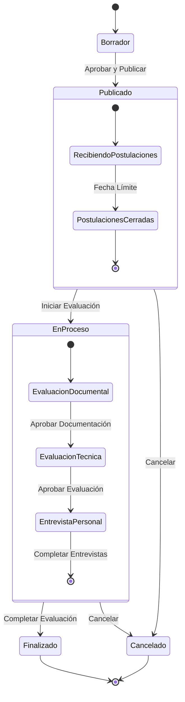
```mermaid
stateDiagram-v2
    [*] --> Borrador
    Borrador --> Publicado: Aprobar y Publicar
    Publicado --> EnProceso: Iniciar Evaluación
    EnProceso --> Finalizado: Completar Evaluación
    EnProceso --> Cancelado: Cancelar
    Publicado --> Cancelado: Cancelar
    Finalizado --> [*]
    Cancelado --> [*]

    state Publicado {
        [*] --> RecibiendoPostulaciones
        RecibiendoPostulaciones --> PostulacionesCerradas: Fecha Límite
        PostulacionesCerradas --> [*]
    }

    state EnProceso {
        [*] --> EvaluacionDocumental
        EvaluacionDocumental --> EvaluacionTecnica: Aprobar Documentación
        EvaluacionTecnica --> EntrevistaPersonal: Aprobar Evaluación
        EntrevistaPersonal --> [*]: Completar Entrevistas
    }
```

## 🔐 Detalles de Seguridad

### Estructura de JWT
```json
{
  "header": {
    "alg": "HS256",
    "typ": "JWT"
  },
  "payload": {
    "sub": "1234567890",
    "name": "Juan Pérez",
    "roles": ["ROLE_POSTULANTE"],
    "permisos": [
      "ver_concursos",
      "postular_concursos",
      "ver_documentos"
    ],
    "iat": 1516239022,
    "exp": 1516242622
  }
}
```

### Niveles de Acceso
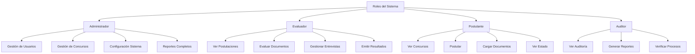
```mermaid
graph TD
    A[Roles del Sistema] --> B[Administrador]
    A --> C[Evaluador]
    A --> D[Postulante]
    A --> E[Auditor]

    B --> B1[Gestión de Usuarios]
    B --> B2[Gestión de Concursos]
    B --> B3[Configuración Sistema]
    B --> B4[Reportes Completos]

    C --> C1[Ver Postulaciones]
    C --> C2[Evaluar Documentos]
    C --> C3[Gestionar Entrevistas]
    C --> C4[Emitir Resultados]

    D --> D1[Ver Concursos]
    D --> D2[Postular]
    D --> D3[Cargar Documentos]
    D --> D4[Ver Estado]

    E --> E1[Ver Auditoría]
    E --> E2[Generar Reportes]
    E --> E3[Verificar Procesos]
```

## 📊 Modelo de Base de Datos

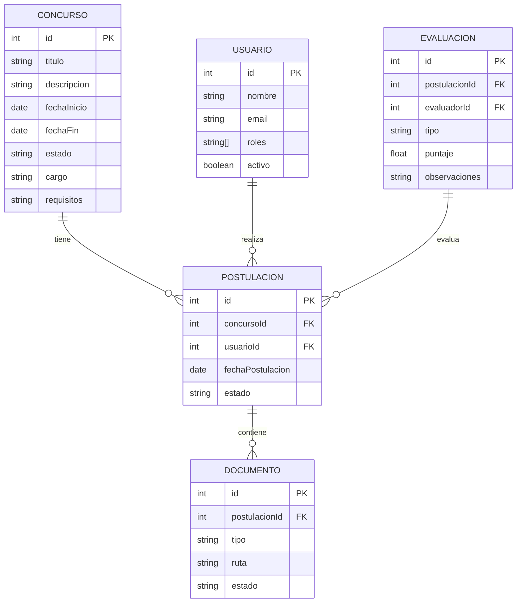
```mermaid
erDiagram
    CONCURSO ||--o{ POSTULACION : tiene
    CONCURSO {
        int id PK
        string titulo
        string descripcion
        date fechaInicio
        date fechaFin
        string estado
        string cargo
        string requisitos
    }
    POSTULACION ||--o{ DOCUMENTO : contiene
    POSTULACION {
        int id PK
        int concursoId FK
        int usuarioId FK
        date fechaPostulacion
        string estado
    }
    DOCUMENTO {
        int id PK
        int postulacionId FK
        string tipo
        string ruta
        string estado
    }
    USUARIO ||--o{ POSTULACION : realiza
    USUARIO {
        int id PK
        string nombre
        string email
        string[] roles
        boolean activo
    }
    EVALUACION ||--o{ POSTULACION : evalua
    EVALUACION {
        int id PK
        int postulacionId FK
        int evaluadorId FK
        string tipo
        float puntaje
        string observaciones
    }
```

## 🔄 Flujos de Datos Detallados

### Autenticación y Autorización
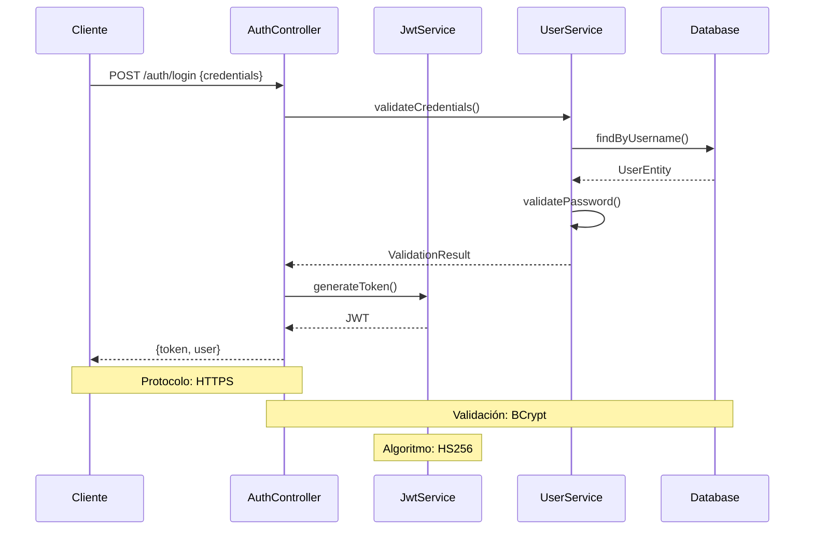
```mermaid
sequenceDiagram
    participant Cliente
    participant AuthController
    participant JwtService
    participant UserService
    participant Database

    Cliente->>AuthController: POST /auth/login {credentials}
    AuthController->>UserService: validateCredentials()
    UserService->>Database: findByUsername()
    Database-->>UserService: UserEntity
    UserService->>UserService: validatePassword()
    UserService-->>AuthController: ValidationResult
    AuthController->>JwtService: generateToken()
    JwtService-->>AuthController: JWT
    AuthController-->>Cliente: {token, user}

    Note over Cliente,AuthController: Protocolo: HTTPS
    Note over AuthController,Database: Validación: BCrypt
    Note over JwtService: Algoritmo: HS256
```

### Gestión de Documentos
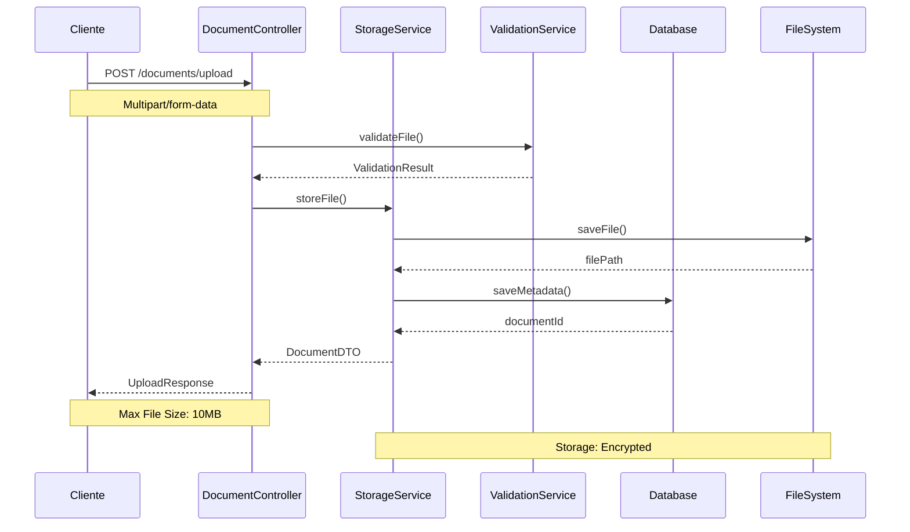
```mermaid
sequenceDiagram
    participant Cliente
    participant DocumentController
    participant StorageService
    participant ValidationService
    participant Database
    participant FileSystem

    Cliente->>DocumentController: POST /documents/upload
    Note over Cliente,DocumentController: Multipart/form-data
    DocumentController->>ValidationService: validateFile()
    ValidationService-->>DocumentController: ValidationResult
    DocumentController->>StorageService: storeFile()
    StorageService->>FileSystem: saveFile()
    FileSystem-->>StorageService: filePath
    StorageService->>Database: saveMetadata()
    Database-->>StorageService: documentId
    StorageService-->>DocumentController: DocumentDTO
    DocumentController-->>Cliente: UploadResponse

    Note over Cliente,DocumentController: Max File Size: 10MB
    Note over StorageService,FileSystem: Storage: Encrypted
```

## 🧩 Componentes Internos

### Frontend Modules
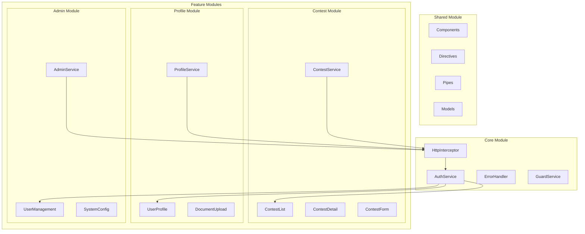
```mermaid
graph TD
    subgraph "Core Module"
        A[AuthService]
        B[HttpInterceptor]
        C[ErrorHandler]
        D[GuardService]
    end

    subgraph "Shared Module"
        E[Components]
        F[Directives]
        G[Pipes]
        H[Models]
    end

    subgraph "Feature Modules"
        subgraph "Contest Module"
            I[ContestList]
            J[ContestDetail]
            K[ContestForm]
            L[ContestService]
        end

        subgraph "Profile Module"
            M[UserProfile]
            N[DocumentUpload]
            O[ProfileService]
        end

        subgraph "Admin Module"
            P[UserManagement]
            Q[SystemConfig]
            R[AdminService]
        end
    end

    A --> I
    A --> M
    A --> P
    B --> A
    L --> B
    O --> B
    R --> B
```

### Backend Components
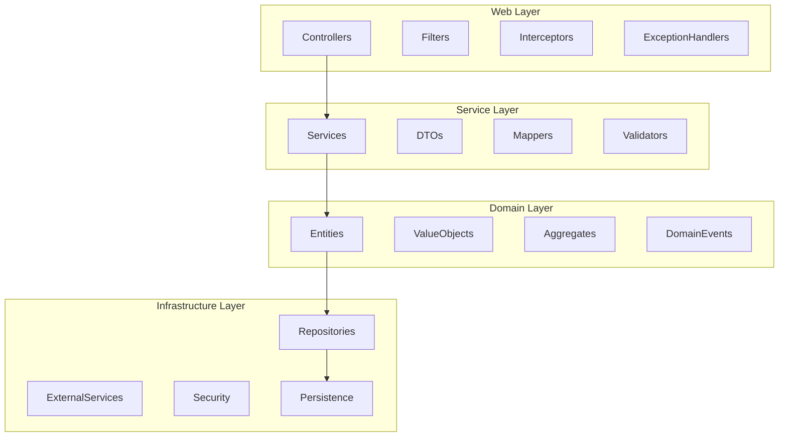
```mermaid
graph TD
    subgraph "Web Layer"
        A[Controllers]
        B[Filters]
        C[Interceptors]
        D[ExceptionHandlers]
    end

    subgraph "Service Layer"
        E[Services]
        F[DTOs]
        G[Mappers]
        H[Validators]
    end

    subgraph "Domain Layer"
        I[Entities]
        J[ValueObjects]
        K[Aggregates]
        L[DomainEvents]
    end

    subgraph "Infrastructure Layer"
        M[Repositories]
        N[ExternalServices]
        O[Security]
        P[Persistence]
    end

    A --> E
    E --> I
    I --> M
    M --> P
```

## 🔌 Interfaces y Protocolos

### API Endpoints
```yaml
auth:
  login:
    path: /api/auth/login
    method: POST
    content-type: application/json
    body: {username: string, password: string}
    response: {token: string, user: UserDTO}

contests:
  list:
    path: /api/contests
    method: GET
    headers: {Authorization: Bearer token}
    query-params: {
      status: string,
      page: number,
      size: number,
      sort: string
    }
    response: {
      content: Contest[],
      totalElements: number,
      totalPages: number
    }

documents:
  upload:
    path: /api/documents/upload
    method: POST
    headers: {
      Authorization: Bearer token,
      Content-Type: multipart/form-data
    }
    body: FormData
    response: {
      documentId: string,
      url: string,
      status: string
    }
```

### Protocolos de Comunicación
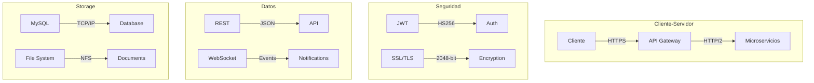
```mermaid
graph TD
    subgraph "Cliente-Servidor"
        A[Cliente] -->|HTTPS| B[API Gateway]
        B -->|HTTP/2| C[Microservicios]
    end

    subgraph "Seguridad"
        D[JWT] -->|HS256| E[Auth]
        F[SSL/TLS] -->|2048-bit| G[Encryption]
    end

    subgraph "Datos"
        H[REST] -->|JSON| I[API]
        J[WebSocket] -->|Events| K[Notifications]
    end

    subgraph "Storage"
        L[MySQL] -->|TCP/IP| M[Database]
        N[File System] -->|NFS| O[Documents]
    end
```

### Interfaces de Servicios
```typescript
interface IAuthService {
    login(credentials: LoginDTO): Promise<AuthResponse>;
    logout(): Promise<void>;
    refreshToken(): Promise<string>;
    validateToken(token: string): boolean;
}

interface IContestService {
    create(contest: ContestDTO): Promise<Contest>;
    update(id: string, contest: ContestDTO): Promise<Contest>;
    delete(id: string): Promise<void>;
    findById(id: string): Promise<Contest>;
    findAll(params: FilterParams): Promise<PagedResponse<Contest>>;
}

interface IDocumentService {
    upload(file: File, metadata: DocumentMetadata): Promise<Document>;
    download(id: string): Promise<Blob>;
    validate(document: Document): Promise<ValidationResult>;
    delete(id: string): Promise<void>;
}

interface INotificationService {
    send(notification: NotificationDTO): Promise<void>;
    subscribe(userId: string): Observable<Notification>;
    markAsRead(notificationId: string): Promise<void>;
    getUnreadCount(): Promise<number>;
}
```

## 🔍 Problemas Conocidos y Mejoras Pendientes

### Flujo de inscripción interrumpido
Existe un problema en el flujo de inscripción a concursos donde los usuarios no pueden retomar el proceso después de navegar a la pestaña de documentación para cargar documentos. El problema ocurre en los siguientes pasos:

1. El usuario inicia el proceso de inscripción a un concurso
2. Durante el proceso, navega a la pestaña de documentación para cargar documentos requeridos
3. Al intentar volver al proceso de inscripción, el sistema no recupera correctamente el estado anterior
4. Se han implementado soluciones parciales como:
   - Banner de retorno en la pestaña de documentación
   - Almacenamiento del estado de inscripción en localStorage
   - Parámetros de URL para recuperar el contexto

Este problema está siendo abordado en la rama `inscripcion` con mejoras en el servicio `InscriptionRecoveryService` y el componente `ReturnToInscriptionBanner`.

### Cambio importante
- La funcionalidad de reemplazo/actualización de documentos ha sido eliminada. Ahora solo es posible eliminar un documento y luego cargar uno nuevo del mismo tipo. Esto mejora la robustez, la experiencia de usuario y la mantenibilidad del sistema.

### Otras mejoras planificadas
- Optimización del rendimiento en la carga de documentos
- Mejora en la validación de documentos en tiempo real
- Implementación de notificaciones push para actualizaciones de estado
- Integración con sistema de firma digital

## 🧪 Testing

### Backend
```bash
cd concurso-backend
mvn test
```

### Frontend
```bash
cd mpd-concursos-app-frontend
pnpm test
```

### Testing de Seguridad
```bash
# Probar corrección del Punto 12 (Validación de Período de Inscripción)
cd concurso-backend
.\scripts\test-security-point-12.ps1
```

Ver documentación completa en: `concurso-backend/TESTING_SECURITY_POINT_12.md`

### Datos de Prueba

El sistema incluye **4 concursos de ejemplo** que se cargan automáticamente:
- **3 concursos normales** basados en concursos reales del MPD
- **1 concurso de prueba de seguridad** con período de inscripción cerrado (para testing del punto 12)

## 📄 Licencia

Este proyecto está bajo la Licencia MIT. Ver el archivo `LICENSE` para más detalles.

---

**Desarrollado para el Ministerio Público de la Defensa de Mendoza** 🏛️