# Defensa Mendoza - Sistema de Concursos

Sistema de gestión de concursos para el Ministerio Público de la Defensa de Mendoza. Esta plataforma permite la gestión integral del proceso de concursos, desde la publicación hasta la evaluación y selección de candidatos.

## 🚀 Características Principales

- **Gestión de Concursos**: Publicación, seguimiento y administración de concursos públicos
- **Portal del Postulante**: Interfaz intuitiva para la inscripción y seguimiento de postulaciones
- **Gestión Documental**: Sistema de carga y validación de documentación requerida
- **Panel Administrativo**: Herramientas completas para la gestión del proceso
- **Sistema de Notificaciones**: Alertas y comunicaciones automáticas
- **Seguimiento de Estados**: Control del progreso de cada concurso y postulación

## 🛠️ Tecnologías Utilizadas

### Frontend
- Angular
- Material Design
- SCSS
- TypeScript
- Electron (para versión de escritorio)

### Backend
- Spring Boot
- Java 17
- MySQL
- JWT para autenticación
- Maven

## 📦 Estructura del Proyecto

```
├── concurso-backend/           # Backend en Spring Boot
│   ├── src/                    
│   │   ├── main/              
│   │   │   ├── java/          # Código fuente Java
│   │   │   └── resources/     # Configuraciones
│   │   └── test/              # Tests
│   └── pom.xml                # Dependencias Maven
│
└── mpd-concursos-app-frontend/ # Frontend en Angular
    ├── src/
    │   ├── app/               # Código fuente Angular
    │   ├── assets/            # Recursos estáticos
    │   └── environments/      # Configuraciones por ambiente
    ├── electron/              # Configuración Electron
    └── package.json           # Dependencias npm
```

## 🏗️ Arquitectura del Sistema


## 🚀 Instalación y Configuración

### Requisitos Previos
- Java 17 o superior
- Node.js 18 o superior
- MySQL 8.0
- Maven 3.8+

### Backend
1. Configurar variables de entorno:
   ```properties
   DB_HOST=localhost
   DB_PORT=3306
   DB_NAME=mpd_concursos
   DB_USERNAME=your_username
   DB_PASSWORD=your_password
   JWT_SECRET=your_secret
   ```

2. Ejecutar:
   ```bash
   cd concurso-backend
   mvn clean install
   mvn spring-boot:run
   ```

### Frontend
1. Instalar dependencias:
   ```bash
   cd mpd-concursos-app-frontend
   npm install
   ```

2. Ejecutar en modo desarrollo:
   ```bash
   npm run start
   ```

3. Para compilar versión de escritorio:
   ```bash
   npm run electron:build
   ```

## 🔐 Seguridad

- Autenticación mediante JWT
- Roles y permisos granulares
- Encriptación de datos sensibles
- Validación de documentos
- Control de sesiones

## 👥 Roles del Sistema

- **Administrador**: Gestión completa del sistema
- **Evaluador**: Revisión de postulaciones y documentación
- **Postulante**: Inscripción y seguimiento de concursos
- **Auditor**: Monitoreo y reportes del sistema

## 📄 Licencia

Este proyecto es propiedad del Ministerio Público de la Defensa de Mendoza.

## 🤝 Contacto

Para soporte o consultas, contactar al equipo de desarrollo del Ministerio Público de la Defensa de Mendoza.

## 📊 Flujos de Datos Principales

### 1. Proceso de Postulación

```mermaid
sequenceDiagram
    actor Postulante
    participant Frontend
    participant AuthController
    participant ContestController
    participant DocumentController
    participant DB
    
    Postulante->>Frontend: Inicia postulación
    Frontend->>AuthController: Valida sesión
    AuthController-->>Frontend: Sesión válida
    Frontend->>ContestController: Solicita datos del concurso
    ContestController-->>Frontend: Devuelve requisitos
    Postulante->>Frontend: Carga documentos
    Frontend->>DocumentController: Envía documentos
    DocumentController->>DB: Almacena documentos
    DB-->>DocumentController: Confirma almacenamiento
    DocumentController-->>Frontend: Confirma carga
    Frontend->>ContestController: Finaliza postulación
    ContestController->>DB: Registra postulación
    DB-->>ContestController: Confirma registro
    ContestController-->>Frontend: Confirma postulación
    Frontend-->>Postulante: Muestra confirmación
```


### 2. Proceso de Evaluación

```mermaid
sequenceDiagram
    actor Evaluador
    participant Frontend
    participant AuthController
    participant ContestController
    participant NotificationController
    participant DB
    
    Evaluador->>Frontend: Accede a evaluaciones
    Frontend->>AuthController: Valida permisos
    AuthController-->>Frontend: Confirma permisos
    Frontend->>ContestController: Solicita postulaciones
    ContestController->>DB: Consulta postulaciones
    DB-->>ContestController: Devuelve datos
    ContestController-->>Frontend: Lista postulaciones
    Evaluador->>Frontend: Evalúa postulación
    Frontend->>ContestController: Envía evaluación
    ContestController->>DB: Guarda evaluación
    ContestController->>NotificationController: Solicita notificación
    NotificationController->>DB: Registra notificación
    DB-->>NotificationController: Confirma registro
    NotificationController-->>Frontend: Confirma proceso
    Frontend-->>Evaluador: Muestra confirmación
```


## 📱 Ejemplos de Uso

### 1. Creación de un Nuevo Concurso
```typescript
// Ejemplo de payload para crear un concurso
const nuevoConcurso = {
  titulo: "Defensor/a Penal - Primera C.J.",
  descripcion: "Concurso para cargo de Defensor Penal",
  fechaInicio: "2024-03-28T00:00:00Z",
  fechaFin: "2024-04-28T23:59:59Z",
  requisitos: [
    "Título de Abogado",
    "5 años de experiencia",
    "Matrícula activa"
  ],
  documentosRequeridos: [
    {
      tipo: "TITULO_GRADO",
      descripcion: "Título de Abogado",
      obligatorio: true
    },
    {
      tipo: "CURRICULUM",
      descripcion: "Curriculum Vitae actualizado",
      obligatorio: true
    }
  ],
  cargo: {
    nombre: "Defensor Penal",
    categoria: "Primera",
    circunscripcion: "Primera"
  }
};
```

### 2. Gestión de Documentos
```java
@PostMapping("/documentos")
public ResponseEntity<DocumentoResponse> cargarDocumento(
    @RequestParam("archivo") MultipartFile archivo,
    @RequestParam("tipo") TipoDocumento tipo,
    @RequestParam("postulacionId") Long postulacionId
) {
    try {
        // Validación de formato y tamaño
        validarDocumento(archivo);
        
        // Procesamiento y almacenamiento
        String rutaArchivo = documentoService.almacenar(archivo);
        
        // Registro en base de datos
        Documento documento = documentoService.registrar(
            Documento.builder()
                .tipo(tipo)
                .ruta(rutaArchivo)
                .postulacionId(postulacionId)
                .estado(EstadoDocumento.PENDIENTE_REVISION)
                .build()
        );
        
        return ResponseEntity.ok(documentoMapper.toResponse(documento));
    } catch (Exception e) {
        log.error("Error al procesar documento", e);
        return ResponseEntity.status(HttpStatus.INTERNAL_SERVER_ERROR).build();
    }
}
```

## 🔄 Ciclo de Vida de un Concurso

```mermaid
stateDiagram-v2
    [*] --> Borrador
    Borrador --> Publicado: Aprobar y Publicar
    Publicado --> EnProceso: Iniciar Evaluación
    EnProceso --> Finalizado: Completar Evaluación
    EnProceso --> Cancelado: Cancelar
    Publicado --> Cancelado: Cancelar
    Finalizado --> [*]
    Cancelado --> [*]

    state Publicado {
        [*] --> RecibiendoPostulaciones
        RecibiendoPostulaciones --> PostulacionesCerradas: Fecha Límite
        PostulacionesCerradas --> [*]
    }

    state EnProceso {
        [*] --> EvaluacionDocumental
        EvaluacionDocumental --> EvaluacionTecnica: Aprobar Documentación
        EvaluacionTecnica --> EntrevistaPersonal: Aprobar Evaluación
        EntrevistaPersonal --> [*]: Completar Entrevistas
    }
```



## 🔐 Detalles de Seguridad

### Estructura de JWT
```json
{
  "header": {
    "alg": "HS256",
    "typ": "JWT"
  },
  "payload": {
    "sub": "1234567890",
    "name": "Juan Pérez",
    "roles": ["ROLE_POSTULANTE"],
    "permisos": [
      "ver_concursos",
      "postular_concursos",
      "ver_documentos"
    ],
    "iat": 1516239022,
    "exp": 1516242622
  }
}
```

### Niveles de Acceso

```mermaid
graph TD
    A[Roles del Sistema] --> B[Administrador]
    A --> C[Evaluador]
    A --> D[Postulante]
    A --> E[Auditor]

    B --> B1[Gestión de Usuarios]
    B --> B2[Gestión de Concursos]
    B --> B3[Configuración Sistema]
    B --> B4[Reportes Completos]

    C --> C1[Ver Postulaciones]
    C --> C2[Evaluar Documentos]
    C --> C3[Gestionar Entrevistas]
    C --> C4[Emitir Resultados]

    D --> D1[Ver Concursos]
    D --> D2[Postular]
    D --> D3[Cargar Documentos]
    D --> D4[Ver Estado]

    E --> E1[Ver Auditoría]
    E --> E2[Generar Reportes]
    E --> E3[Verificar Procesos]
```


## 📊 Modelo de Base de Datos

