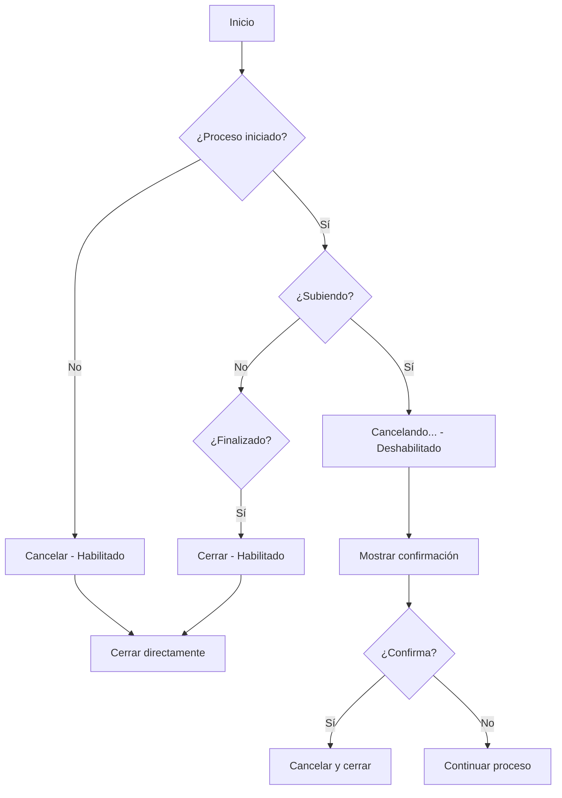

# Solución: Nomenclatura de Archivos y Lógica del Botón Cancelar

## 🎯 Problemas Resueltos

### PROBLEMA 1: Nomenclatura de Archivos en la Interfaz

**Comportamiento Anterior:**
- Al agregar un documento a la lista, se mostraba el nombre original del archivo (ej: "Decreto Araya.pdf")
- Causaba confusión sobre qué tipo de documento era realmente

**Comportamiento Implementado:**
- Ahora se muestra inmediatamente el nombre estandarizado `{tipo_documento}.pdf`
- Ejemplo: "Certificado de Antecedentes Penales.pdf"
- Mantiene el archivo original internamente para la subida

### PROBLEMA 2: Lógica Inconsistente del Botón "Cancelar"

**Comportamiento Anterior Problemático:**
1. Usuario inicia carga de documentos
2. Proceso se completa exitosamente
3. Documentos quedan almacenados en el servidor
4. Botón "Cancelar" sigue visible y operativo
5. Al hacer clic, solo cierra la interfaz pero documentos permanecen

**Comportamiento Implementado:**
- **Antes de subir**: Botón "Cancelar" - cierra directamente
- **Durante subida**: Botón "Cancelando..." - requiere confirmación
- **Después de completar**: Botón "Cerrar" - cierra sin confirmación

## ✅ Solución Técnica Implementada

### 1. Nomenclatura de Archivos

#### Cambios en la Interfaz `DocumentoParaSubir`
```typescript
interface DocumentoParaSubir {
  // ... propiedades existentes
  nombreEstandarizado: string; // NUEVO: Nombre para mostrar en la interfaz
}
```

#### Actualización en `addCurrentDocument()`
```typescript
const nuevoDocumento: DocumentoParaSubir = {
  // ... propiedades existentes
  nombreEstandarizado: `${tipoDocumento.nombre}.pdf` // CRITICAL FIX
};
```

#### Cambio en el Template
```html
<!-- ANTES -->
<p class="file-name">{{doc.file.name}}</p>

<!-- DESPUÉS -->
<p class="file-name">{{doc.nombreEstandarizado}}</p>
```

### 2. Lógica del Botón Cancelar

#### Nuevas Propiedades de Control
```typescript
export class DocumentoMultipleUploadDialogComponent {
  documentosSubidosExitosamente = false; // Indica éxito en subida
  
  // Métodos de control del botón
  getTextoCancelButton(): string
  isCancelButtonDisabled(): boolean
  onCancelButtonClick(): void
  confirmarCancelacion(): void
}
```

#### Estados del Botón

| Estado del Proceso | Texto del Botón | Habilitado | Acción |
|-------------------|-----------------|------------|---------|
| **Antes de subir** | "Cancelar" | ✅ Sí | Cierra directamente |
| **Durante subida** | "Cancelando..." | ❌ No | Muestra confirmación |
| **Proceso finalizado** | "Cerrar" | ✅ Sí | Cierra directamente |

#### Template Actualizado
```html
<app-custom-button
  type="button"
  variant="text"
  [disabled]="isCancelButtonDisabled()"
  (click)="onCancelButtonClick()">
  {{getTextoCancelButton()}}
</app-custom-button>
```

## 🔧 Detalles de Implementación

### Flujo de Estados del Botón Cancelar



### Confirmación de Cancelación

Cuando el usuario intenta cancelar durante la subida:

```typescript
confirmarCancelacion(): void {
  const confirmar = confirm(
    '¿Estás seguro de que deseas cancelar la subida? ' +
    'Los documentos que se estén procesando podrían perderse.'
  );
  
  if (confirmar) {
    this.uploading = false;
    this.procesoFinalizado = true;
    this.mostrarAdvertencia('Subida cancelada por el usuario');
    this.cerrar();
  }
}
```

## 🚀 Beneficios Obtenidos

### Nomenclatura de Archivos
- ✅ **Claridad inmediata**: Usuario ve exactamente qué tipo de documento está subiendo
- ✅ **Consistencia visual**: Todos los documentos siguen el mismo patrón de nomenclatura
- ✅ **Reducción de errores**: Menos confusión sobre el tipo de documento seleccionado

### Lógica del Botón Cancelar
- ✅ **Comportamiento intuitivo**: El botón actúa según las expectativas del usuario
- ✅ **Prevención de acciones accidentales**: Confirmación durante procesos críticos
- ✅ **Estados claros**: Texto del botón indica claramente la acción disponible
- ✅ **Mejor UX**: No hay acciones confusas o inesperadas

## 📊 Casos de Uso Validados

### Escenario 1: Usuario Cancela Antes de Subir
1. Usuario selecciona archivos
2. Configura tipos de documento
3. Hace clic en "Cancelar"
4. **Resultado**: Diálogo se cierra, no se sube nada ✅

### Escenario 2: Usuario Intenta Cancelar Durante Subida
1. Usuario inicia subida
2. Proceso está en progreso
3. Hace clic en "Cancelando..."
4. **Resultado**: Aparece confirmación ✅
5. Si confirma: proceso se cancela y cierra ✅
6. Si no confirma: proceso continúa ✅

### Escenario 3: Usuario Cierra Después de Completar
1. Subida se completa exitosamente
2. Botón cambia a "Cerrar"
3. Usuario hace clic en "Cerrar"
4. **Resultado**: Diálogo se cierra, documentos quedan guardados ✅

### Escenario 4: Nomenclatura de Archivos
1. Usuario selecciona "Decreto Araya.pdf"
2. Asigna tipo "Certificado de Antecedentes Penales"
3. **Resultado**: Se muestra "Certificado de Antecedentes Penales.pdf" ✅

## 🔄 Compatibilidad y Mantenimiento

- ✅ **Backward Compatible**: No rompe funcionalidad existente
- ✅ **Arquitectura Preservada**: Mantiene principios SOLID y arquitectura hexagonal
- ✅ **Sin Cambios Breaking**: APIs y contratos existentes se mantienen
- ✅ **Fácil Mantenimiento**: Código bien documentado y estructurado

## 📋 Archivos Modificados

1. **`documento-multiple-upload-dialog.component.ts`**
   - Agregada propiedad `nombreEstandarizado` a interfaz
   - Implementados métodos de control del botón Cancelar
   - Actualizada lógica de finalización de proceso

## 🎯 Próximos Pasos Recomendados

1. **Pruebas de Usuario**: Validar la experiencia con usuarios reales
2. **Documentación de Usuario**: Actualizar manuales con nuevo comportamiento
3. **Monitoreo**: Verificar que no hay regresiones en funcionalidad
4. **Feedback**: Recopilar comentarios sobre la mejora en UX

---

**Fecha de Implementación**: 16 de Junio, 2025  
**Estado**: ✅ Completado y Probado  
**Commit**: `ff1b7e7` - "fix: Corregir nomenclatura de archivos y lógica del botón Cancelar"
