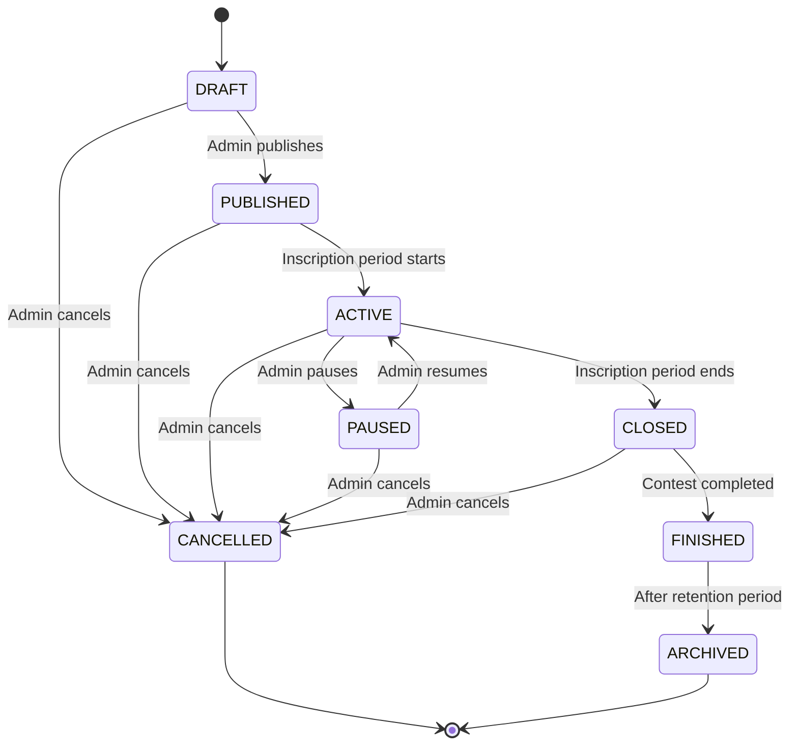
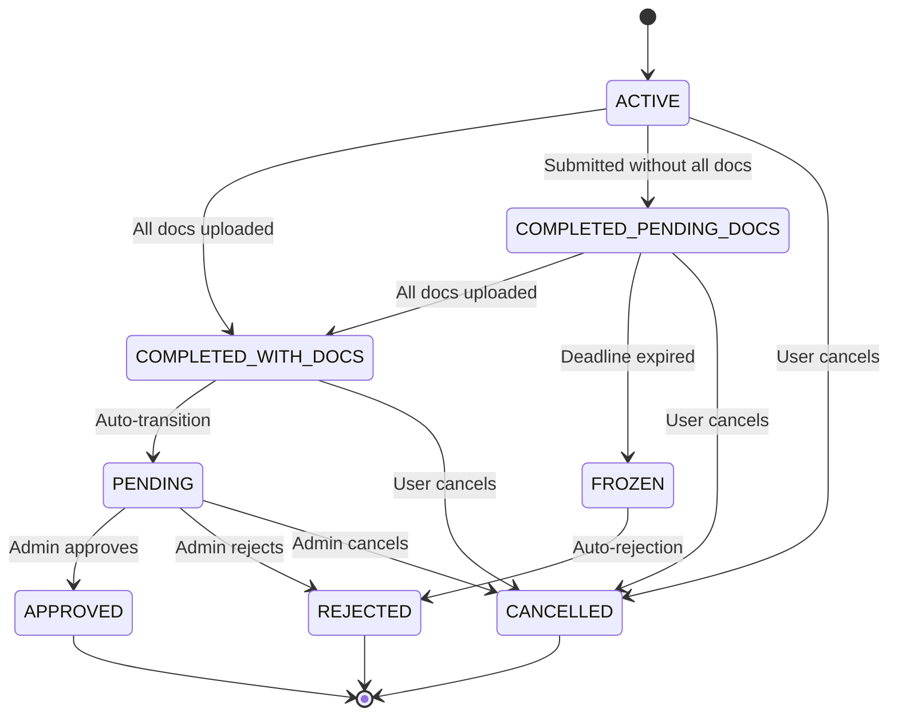
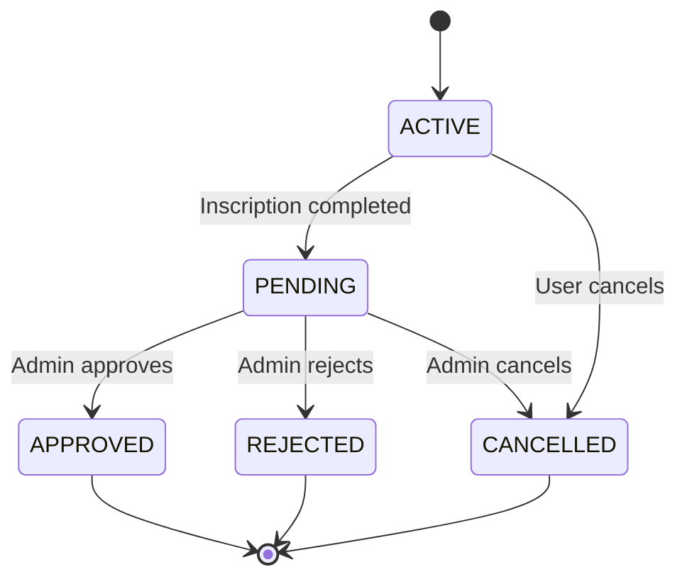

# State Management Implementation Guide
## MPD Concursos Project

**Companion Document to:** STATE_MANAGEMENT_AUDIT_REPORT.md  
**Purpose:** Detailed implementation specifications and code examples

---

## 1. State Machine Diagrams

### 1.1 Contest State Machine



### 1.2 Inscription State Machine



### 1.3 Postulation State Machine



---

## 2. Backend Implementation Specifications

### 2.1 Unified State Enums

#### ContestStatus.java (Final Version)
```java
package ar.gov.mpd.concursobackend.contest.domain.enums;

/**
 * Unified contest status enum
 * Replaces all existing ContestStatus definitions
 */
public enum ContestStatus {
    DRAFT("Draft", "Borrador"),
    PUBLISHED("Published", "Publicado"),
    ACTIVE("Active", "Activo"),
    PAUSED("Paused", "Pausado"),
    CLOSED("Closed", "Cerrado"),
    FINISHED("Finished", "Finalizado"),
    CANCELLED("Cancelled", "Cancelado"),
    ARCHIVED("Archived", "Archivado");

    private final String englishName;
    private final String spanishName;

    ContestStatus(String englishName, String spanishName) {
        this.englishName = englishName;
        this.spanishName = spanishName;
    }

    public String getEnglishName() { return englishName; }
    public String getSpanishName() { return spanishName; }

    public static ContestStatus fromString(String status) {
        try {
            return ContestStatus.valueOf(status.toUpperCase());
        } catch (IllegalArgumentException e) {
            throw new IllegalArgumentException("Invalid contest status: " + status);
        }
    }
}
```

#### PostulationStatus.java (New)
```java
package ar.gov.mpd.concursobackend.postulation.domain.enums;

/**
 * Postulation status enum
 * New enum to replace string-based status handling
 */
public enum PostulationStatus {
    ACTIVE("Active", "En Proceso"),
    PENDING("Pending", "Pendiente"),
    APPROVED("Approved", "Aprobada"),
    REJECTED("Rejected", "Rechazada"),
    CANCELLED("Cancelled", "Cancelada");

    private final String englishName;
    private final String spanishName;

    PostulationStatus(String englishName, String spanishName) {
        this.englishName = englishName;
        this.spanishName = spanishName;
    }

    public String getEnglishName() { return englishName; }
    public String getSpanishName() { return spanishName; }

    public static PostulationStatus fromString(String status) {
        try {
            return PostulationStatus.valueOf(status.toUpperCase());
        } catch (IllegalArgumentException e) {
            throw new IllegalArgumentException("Invalid postulation status: " + status);
        }
    }
}
```

### 2.2 State Machine Implementation

#### ContestStateMachine.java
```java
package ar.gov.mpd.concursobackend.contest.domain.service;

import ar.gov.mpd.concursobackend.contest.domain.enums.ContestStatus;
import org.springframework.stereotype.Component;

import java.util.Map;
import java.util.Set;

@Component
public class ContestStateMachine {
    
    private static final Map<ContestStatus, Set<ContestStatus>> VALID_TRANSITIONS = Map.of(
        ContestStatus.DRAFT, Set.of(ContestStatus.PUBLISHED, ContestStatus.CANCELLED),
        ContestStatus.PUBLISHED, Set.of(ContestStatus.ACTIVE, ContestStatus.CANCELLED),
        ContestStatus.ACTIVE, Set.of(ContestStatus.PAUSED, ContestStatus.CLOSED, ContestStatus.CANCELLED),
        ContestStatus.PAUSED, Set.of(ContestStatus.ACTIVE, ContestStatus.CANCELLED),
        ContestStatus.CLOSED, Set.of(ContestStatus.FINISHED, ContestStatus.CANCELLED),
        ContestStatus.FINISHED, Set.of(ContestStatus.ARCHIVED),
        ContestStatus.CANCELLED, Set.of(), // Final state
        ContestStatus.ARCHIVED, Set.of()   // Final state
    );

    public boolean canTransition(ContestStatus from, ContestStatus to) {
        return VALID_TRANSITIONS.getOrDefault(from, Set.of()).contains(to);
    }

    public void validateTransition(ContestStatus from, ContestStatus to) {
        if (!canTransition(from, to)) {
            throw new IllegalStateException(
                String.format("Invalid state transition from %s to %s", from, to)
            );
        }
    }

    public Set<ContestStatus> getValidNextStates(ContestStatus current) {
        return VALID_TRANSITIONS.getOrDefault(current, Set.of());
    }

    public boolean isFinalState(ContestStatus status) {
        return VALID_TRANSITIONS.get(status).isEmpty();
    }
}
```

#### InscriptionStateMachine.java
```java
package ar.gov.mpd.concursobackend.inscription.domain.service;

import ar.gov.mpd.concursobackend.inscription.domain.model.InscriptionState;
import org.springframework.stereotype.Component;

import java.util.Map;
import java.util.Set;

@Component
public class InscriptionStateMachine {
    
    private static final Map<InscriptionState, Set<InscriptionState>> VALID_TRANSITIONS = Map.of(
        InscriptionState.ACTIVE, Set.of(
            InscriptionState.COMPLETED_WITH_DOCS, 
            InscriptionState.COMPLETED_PENDING_DOCS, 
            InscriptionState.CANCELLED
        ),
        InscriptionState.COMPLETED_WITH_DOCS, Set.of(
            InscriptionState.PENDING, 
            InscriptionState.CANCELLED
        ),
        InscriptionState.COMPLETED_PENDING_DOCS, Set.of(
            InscriptionState.COMPLETED_WITH_DOCS, 
            InscriptionState.FROZEN, 
            InscriptionState.CANCELLED
        ),
        InscriptionState.PENDING, Set.of(
            InscriptionState.APPROVED, 
            InscriptionState.REJECTED, 
            InscriptionState.CANCELLED
        ),
        InscriptionState.FROZEN, Set.of(InscriptionState.REJECTED),
        InscriptionState.APPROVED, Set.of(), // Final state
        InscriptionState.REJECTED, Set.of(), // Final state
        InscriptionState.CANCELLED, Set.of() // Final state
    );

    public boolean canTransition(InscriptionState from, InscriptionState to) {
        return VALID_TRANSITIONS.getOrDefault(from, Set.of()).contains(to);
    }

    public void validateTransition(InscriptionState from, InscriptionState to) {
        if (!canTransition(from, to)) {
            throw new IllegalStateException(
                String.format("Invalid inscription state transition from %s to %s", from, to)
            );
        }
    }

    public Set<InscriptionState> getValidNextStates(InscriptionState current) {
        return VALID_TRANSITIONS.getOrDefault(current, Set.of());
    }

    public boolean isFinalState(InscriptionState status) {
        return VALID_TRANSITIONS.get(status).isEmpty();
    }

    public boolean allowsDocumentUpload(InscriptionState status) {
        return Set.of(
            InscriptionState.ACTIVE, 
            InscriptionState.COMPLETED_PENDING_DOCS
        ).contains(status);
    }

    public boolean isResumable(InscriptionState status) {
        return Set.of(
            InscriptionState.ACTIVE, 
            InscriptionState.COMPLETED_PENDING_DOCS
        ).contains(status);
    }
}
```

### 2.3 Service Layer Updates

#### Updated AdminInscriptionService.java
```java
@Service
@Transactional
public class AdminInscriptionService {
    
    private final InscriptionStateMachine stateMachine;
    private final InscriptionRepository inscriptionRepository;
    
    public AdminInscriptionService(
        InscriptionStateMachine stateMachine,
        InscriptionRepository inscriptionRepository
    ) {
        this.stateMachine = stateMachine;
        this.inscriptionRepository = inscriptionRepository;
    }

    public Inscription changeInscriptionState(String id, InscriptionState newState, String reason) {
        Inscription inscription = getInscriptionById(id);
        
        // Validate state transition
        stateMachine.validateTransition(inscription.getState(), newState);
        
        // Update state
        inscription.setState(newState);
        inscription.setLastUpdated(LocalDateTime.now());
        
        // Add audit log
        addStateChangeAuditLog(inscription, newState, reason);
        
        // Save and notify
        Inscription updatedInscription = inscriptionRepository.save(inscription);
        sendStateChangeNotification(updatedInscription, reason);
        
        return updatedInscription;
    }

    public Set<InscriptionState> getValidNextStates(String inscriptionId) {
        Inscription inscription = getInscriptionById(inscriptionId);
        return stateMachine.getValidNextStates(inscription.getState());
    }
    
    private void addStateChangeAuditLog(Inscription inscription, InscriptionState newState, String reason) {
        // Implementation for audit logging
    }
    
    private void sendStateChangeNotification(Inscription inscription, String reason) {
        // Implementation for notifications
    }
}
```

---

## 3. Frontend Implementation Specifications

### 3.1 Core State Management Service

#### state-management.service.ts
```typescript
import { Injectable } from '@angular/core';
import { ContestStateMachine } from './machines/contest-state.machine';
import { InscriptionStateMachine } from './machines/inscription-state.machine';
import { PostulationStateMachine } from './machines/postulation-state.machine';
import { StateTranslationRegistry } from './registries/state-translation.registry';
import { StateStyleRegistry } from './registries/state-style.registry';

export enum EntityType {
  CONTEST = 'CONTEST',
  INSCRIPTION = 'INSCRIPTION',
  POSTULATION = 'POSTULATION'
}

export interface ValidationResult {
  valid: boolean;
  reason?: string;
}

@Injectable({ providedIn: 'root' })
export class StateManagementService {
  
  private readonly contestStateMachine = new ContestStateMachine();
  private readonly inscriptionStateMachine = new InscriptionStateMachine();
  private readonly postulationStateMachine = new PostulationStateMachine();

  validateTransition(entityType: EntityType, from: string, to: string): ValidationResult {
    try {
      switch (entityType) {
        case EntityType.CONTEST:
          return this.contestStateMachine.validateTransition(from, to);
        case EntityType.INSCRIPTION:
          return this.inscriptionStateMachine.validateTransition(from, to);
        case EntityType.POSTULATION:
          return this.postulationStateMachine.validateTransition(from, to);
        default:
          return { valid: false, reason: 'Unknown entity type' };
      }
    } catch (error) {
      return { valid: false, reason: error.message };
    }
  }

  getValidNextStates(entityType: EntityType, currentState: string): string[] {
    switch (entityType) {
      case EntityType.CONTEST:
        return this.contestStateMachine.getValidNextStates(currentState);
      case EntityType.INSCRIPTION:
        return this.inscriptionStateMachine.getValidNextStates(currentState);
      case EntityType.POSTULATION:
        return this.postulationStateMachine.getValidNextStates(currentState);
      default:
        return [];
    }
  }

  translateState(entityType: EntityType, state: string): string {
    return StateTranslationRegistry.translate(entityType, state);
  }

  getStateClass(entityType: EntityType, state: string): string {
    return StateStyleRegistry.getClass(entityType, state);
  }

  isFinalState(entityType: EntityType, state: string): boolean {
    switch (entityType) {
      case EntityType.CONTEST:
        return this.contestStateMachine.isFinalState(state);
      case EntityType.INSCRIPTION:
        return this.inscriptionStateMachine.isFinalState(state);
      case EntityType.POSTULATION:
        return this.postulationStateMachine.isFinalState(state);
      default:
        return false;
    }
  }

  canResumeInscription(state: string): boolean {
    return this.inscriptionStateMachine.isResumable(state);
  }

  allowsDocumentUpload(state: string): boolean {
    return this.inscriptionStateMachine.allowsDocumentUpload(state);
  }
}
```

### 3.2 State Machine Implementations

#### contest-state.machine.ts
```typescript
export class ContestStateMachine {
  private static readonly VALID_TRANSITIONS = new Map<string, Set<string>>([
    ['DRAFT', new Set(['PUBLISHED', 'CANCELLED'])],
    ['PUBLISHED', new Set(['ACTIVE', 'CANCELLED'])],
    ['ACTIVE', new Set(['PAUSED', 'CLOSED', 'CANCELLED'])],
    ['PAUSED', new Set(['ACTIVE', 'CANCELLED'])],
    ['CLOSED', new Set(['FINISHED', 'CANCELLED'])],
    ['FINISHED', new Set(['ARCHIVED'])],
    ['CANCELLED', new Set()],
    ['ARCHIVED', new Set()]
  ]);

  validateTransition(from: string, to: string): ValidationResult {
    const validNextStates = ContestStateMachine.VALID_TRANSITIONS.get(from);
    if (!validNextStates) {
      return { valid: false, reason: `Unknown state: ${from}` };
    }

    if (!validNextStates.has(to)) {
      return { valid: false, reason: `Cannot transition from ${from} to ${to}` };
    }

    return { valid: true };
  }

  getValidNextStates(currentState: string): string[] {
    return Array.from(ContestStateMachine.VALID_TRANSITIONS.get(currentState) || []);
  }

  isFinalState(state: string): boolean {
    return (ContestStateMachine.VALID_TRANSITIONS.get(state)?.size || 0) === 0;
  }
}
```

#### inscription-state.machine.ts
```typescript
export class InscriptionStateMachine {
  private static readonly VALID_TRANSITIONS = new Map<string, Set<string>>([
    ['ACTIVE', new Set(['COMPLETED_WITH_DOCS', 'COMPLETED_PENDING_DOCS', 'CANCELLED'])],
    ['COMPLETED_WITH_DOCS', new Set(['PENDING', 'CANCELLED'])],
    ['COMPLETED_PENDING_DOCS', new Set(['COMPLETED_WITH_DOCS', 'FROZEN', 'CANCELLED'])],
    ['PENDING', new Set(['APPROVED', 'REJECTED', 'CANCELLED'])],
    ['FROZEN', new Set(['REJECTED'])],
    ['APPROVED', new Set()],
    ['REJECTED', new Set()],
    ['CANCELLED', new Set()]
  ]);

  private static readonly RESUMABLE_STATES = new Set(['ACTIVE', 'COMPLETED_PENDING_DOCS']);
  private static readonly DOCUMENT_UPLOAD_STATES = new Set(['ACTIVE', 'COMPLETED_PENDING_DOCS']);

  validateTransition(from: string, to: string): ValidationResult {
    const validNextStates = InscriptionStateMachine.VALID_TRANSITIONS.get(from);
    if (!validNextStates) {
      return { valid: false, reason: `Unknown inscription state: ${from}` };
    }

    if (!validNextStates.has(to)) {
      return { valid: false, reason: `Cannot transition inscription from ${from} to ${to}` };
    }

    return { valid: true };
  }

  getValidNextStates(currentState: string): string[] {
    return Array.from(InscriptionStateMachine.VALID_TRANSITIONS.get(currentState) || []);
  }

  isFinalState(state: string): boolean {
    return (InscriptionStateMachine.VALID_TRANSITIONS.get(state)?.size || 0) === 0;
  }

  isResumable(state: string): boolean {
    return InscriptionStateMachine.RESUMABLE_STATES.has(state);
  }

  allowsDocumentUpload(state: string): boolean {
    return InscriptionStateMachine.DOCUMENT_UPLOAD_STATES.has(state);
  }
}
```

### 3.3 Translation and Style Registries

#### state-translation.registry.ts
```typescript
import { EntityType } from '../state-management.service';

export class StateTranslationRegistry {
  private static readonly TRANSLATIONS = new Map<EntityType, Map<string, string>>([
    [EntityType.CONTEST, new Map([
      ['DRAFT', 'Borrador'],
      ['PUBLISHED', 'Publicado'],
      ['ACTIVE', 'Activo'],
      ['PAUSED', 'Pausado'],
      ['CLOSED', 'Cerrado'],
      ['FINISHED', 'Finalizado'],
      ['CANCELLED', 'Cancelado'],
      ['ARCHIVED', 'Archivado']
    ])],
    [EntityType.INSCRIPTION, new Map([
      ['ACTIVE', 'En Proceso'],
      ['PENDING', 'Pendiente'],
      ['COMPLETED_WITH_DOCS', 'Completada con Documentos'],
      ['COMPLETED_PENDING_DOCS', 'Documentos Pendientes'],
      ['FROZEN', 'Congelada'],
      ['APPROVED', 'Aprobada'],
      ['REJECTED', 'Rechazada'],
      ['CANCELLED', 'Cancelada'],
      // Legacy support
      ['IN_PROCESS', 'En Proceso'],
      ['PENDIENTE', 'Pendiente'],
      ['INSCRIPTO', 'Aprobada'],
      ['CONFIRMADA', 'Pendiente']
    ])],
    [EntityType.POSTULATION, new Map([
      ['ACTIVE', 'En Proceso'],
      ['PENDING', 'Pendiente'],
      ['APPROVED', 'Aprobada'],
      ['REJECTED', 'Rechazada'],
      ['CANCELLED', 'Cancelada']
    ])]
  ]);

  static translate(entityType: EntityType, state: string): string {
    const entityTranslations = this.TRANSLATIONS.get(entityType);
    return entityTranslations?.get(state) ?? state;
  }

  static getAllTranslations(entityType: EntityType): Map<string, string> {
    return this.TRANSLATIONS.get(entityType) ?? new Map();
  }
}
```

#### state-style.registry.ts
```typescript
import { EntityType } from '../state-management.service';

export class StateStyleRegistry {
  private static readonly STYLE_CLASSES = new Map<EntityType, Map<string, string>>([
    [EntityType.CONTEST, new Map([
      ['DRAFT', 'status-draft'],
      ['PUBLISHED', 'status-published'],
      ['ACTIVE', 'status-active'],
      ['PAUSED', 'status-paused'],
      ['CLOSED', 'status-closed'],
      ['FINISHED', 'status-finished'],
      ['CANCELLED', 'status-cancelled'],
      ['ARCHIVED', 'status-archived']
    ])],
    [EntityType.INSCRIPTION, new Map([
      ['ACTIVE', 'status-in-process'],
      ['PENDING', 'status-pending'],
      ['COMPLETED_WITH_DOCS', 'status-completed'],
      ['COMPLETED_PENDING_DOCS', 'status-pending-docs'],
      ['FROZEN', 'status-frozen'],
      ['APPROVED', 'status-approved'],
      ['REJECTED', 'status-rejected'],
      ['CANCELLED', 'status-cancelled']
    ])],
    [EntityType.POSTULATION, new Map([
      ['ACTIVE', 'status-in-process'],
      ['PENDING', 'status-pending'],
      ['APPROVED', 'status-approved'],
      ['REJECTED', 'status-rejected'],
      ['CANCELLED', 'status-cancelled']
    ])]
  ]);

  static getClass(entityType: EntityType, state: string): string {
    const entityClasses = this.STYLE_CLASSES.get(entityType);
    return entityClasses?.get(state) ?? 'status-unknown';
  }
}
```

### 3.4 Updated Components

#### Updated contest-status-badge.component.ts
```typescript
import { Component, Input } from '@angular/core';
import { CommonModule } from '@angular/common';
import { StateManagementService, EntityType } from '@core/services/state-management/state-management.service';

@Component({
  selector: 'app-contest-status-badge',
  standalone: true,
  imports: [CommonModule],
  template: `
    <span
      class="status-badge"
      [class]="getStatusClass()"
      [attr.aria-label]="getStatusLabel()"
      [title]="getStatusLabel()">
      <i *ngIf="showIcon && getStatusIcon()" [class]="getStatusIcon()" aria-hidden="true"></i>
      {{ getStatusLabel() }}
    </span>
  `,
  styleUrls: ['./contest-status-badge.component.scss']
})
export class ContestStatusBadgeComponent {
  @Input() status: string = '';
  @Input() entityType: EntityType = EntityType.CONTEST;
  @Input() showIcon = true;

  constructor(private stateManagementService: StateManagementService) {}

  getStatusLabel(): string {
    return this.stateManagementService.translateState(this.entityType, this.status);
  }

  getStatusClass(): string {
    return this.stateManagementService.getStateClass(this.entityType, this.status);
  }

  getStatusIcon(): string {
    // Icon mapping based on entity type and status
    const iconMap = new Map<string, string>([
      ['DRAFT', 'fas fa-edit'],
      ['PUBLISHED', 'fas fa-eye'],
      ['ACTIVE', 'fas fa-play-circle'],
      ['PAUSED', 'fas fa-pause-circle'],
      ['CLOSED', 'fas fa-stop-circle'],
      ['FINISHED', 'fas fa-check-circle'],
      ['CANCELLED', 'fas fa-ban'],
      ['ARCHIVED', 'fas fa-archive'],
      ['PENDING', 'fas fa-clock'],
      ['APPROVED', 'fas fa-check'],
      ['REJECTED', 'fas fa-times'],
      ['FROZEN', 'fas fa-snowflake']
    ]);

    return iconMap.get(this.status) ?? 'fas fa-question-circle';
  }
}
```

---

## 4. Migration Strategy

### 4.1 Database Migration Scripts

#### 001_unify_contest_status.sql
```sql
-- Update contest status values to match unified enum
UPDATE contests
SET status = CASE
    WHEN status = 'PUBLISHED' THEN 'PUBLISHED'
    WHEN status = 'ACTIVE' THEN 'ACTIVE'
    WHEN status = 'DRAFT' THEN 'DRAFT'
    WHEN status = 'CLOSED' THEN 'CLOSED'
    WHEN status = 'CANCELLED' THEN 'CANCELLED'
    WHEN status = 'IN_PROGRESS' THEN 'ACTIVE' -- Map legacy status
    ELSE 'DRAFT' -- Default for unknown statuses
END;

-- Update enum constraint
ALTER TABLE contests
MODIFY COLUMN status ENUM('DRAFT', 'PUBLISHED', 'ACTIVE', 'PAUSED', 'CLOSED', 'FINISHED', 'CANCELLED', 'ARCHIVED') NOT NULL;
```

#### 002_add_postulation_status_enum.sql
```sql
-- Add postulation status enum constraint
ALTER TABLE inscriptions
MODIFY COLUMN status ENUM('ACTIVE', 'PENDING', 'COMPLETED_WITH_DOCS', 'COMPLETED_PENDING_DOCS', 'FROZEN', 'APPROVED', 'REJECTED', 'CANCELLED') NOT NULL;

-- Add audit table for state changes
CREATE TABLE state_change_audit (
    id BIGINT PRIMARY KEY AUTO_INCREMENT,
    entity_type ENUM('CONTEST', 'INSCRIPTION', 'POSTULATION') NOT NULL,
    entity_id VARCHAR(255) NOT NULL,
    from_state VARCHAR(50),
    to_state VARCHAR(50) NOT NULL,
    changed_by VARCHAR(255) NOT NULL,
    reason TEXT,
    changed_at TIMESTAMP DEFAULT CURRENT_TIMESTAMP,
    INDEX idx_entity (entity_type, entity_id),
    INDEX idx_changed_at (changed_at)
);
```

### 4.2 Feature Flag Implementation

#### state-management.feature-flag.ts
```typescript
@Injectable({ providedIn: 'root' })
export class StateManagementFeatureFlag {
  private readonly USE_NEW_STATE_MANAGEMENT = environment.features?.newStateManagement ?? false;

  useNewStateManagement(): boolean {
    return this.USE_NEW_STATE_MANAGEMENT;
  }

  // Wrapper methods for gradual migration
  translateState(entityType: EntityType, state: string): string {
    if (this.useNewStateManagement()) {
      return this.stateManagementService.translateState(entityType, state);
    } else {
      return this.legacyStateTranslationService.translate(state);
    }
  }
}
```

### 4.3 Testing Strategy

#### State Machine Unit Tests
```typescript
describe('ContestStateMachine', () => {
  let stateMachine: ContestStateMachine;

  beforeEach(() => {
    stateMachine = new ContestStateMachine();
  });

  describe('validateTransition', () => {
    it('should allow valid transitions', () => {
      const result = stateMachine.validateTransition('DRAFT', 'PUBLISHED');
      expect(result.valid).toBe(true);
    });

    it('should reject invalid transitions', () => {
      const result = stateMachine.validateTransition('FINISHED', 'DRAFT');
      expect(result.valid).toBe(false);
      expect(result.reason).toContain('Cannot transition');
    });

    it('should reject transitions from final states', () => {
      const result = stateMachine.validateTransition('CANCELLED', 'ACTIVE');
      expect(result.valid).toBe(false);
    });
  });

  describe('getValidNextStates', () => {
    it('should return correct next states for DRAFT', () => {
      const nextStates = stateMachine.getValidNextStates('DRAFT');
      expect(nextStates).toEqual(['PUBLISHED', 'CANCELLED']);
    });

    it('should return empty array for final states', () => {
      const nextStates = stateMachine.getValidNextStates('ARCHIVED');
      expect(nextStates).toEqual([]);
    });
  });
});
```

---

## 5. Rollback Plan

### 5.1 Code Rollback Strategy
- Maintain feature flags for instant rollback
- Keep legacy code paths until full migration
- Implement gradual rollout with canary deployments

### 5.2 Database Rollback Scripts
```sql
-- Rollback contest status changes
UPDATE contests
SET status = CASE
    WHEN status = 'ACTIVE' AND created_at < '2024-12-01' THEN 'IN_PROGRESS'
    ELSE status
END;

-- Restore original enum constraint
ALTER TABLE contests
MODIFY COLUMN status ENUM('DRAFT', 'PUBLISHED', 'ACTIVE', 'IN_PROGRESS', 'CLOSED', 'CANCELLED') NOT NULL;
```

### 5.3 Monitoring and Alerts
- Set up alerts for state transition failures
- Monitor performance impact of new state management
- Track error rates during migration period

---

This implementation guide provides the detailed specifications needed to execute the state management refactoring plan outlined in the audit report.
