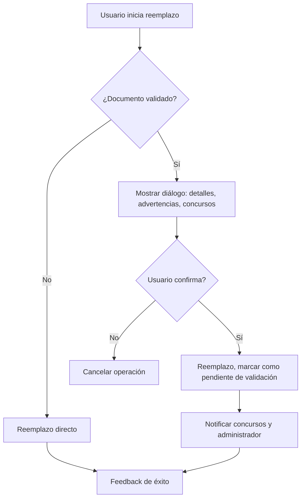

# Plan de Rediseño: Reemplazo de Documentos por el Usuario

## 1. Objetivo
Permitir que el usuario común pueda reemplazar documentación ya cargada, tanto desde el paso 3 del proceso de inscripción como desde la pestaña de documentación en la sección de perfil, con reglas claras según el estado de validación y relación con concursos.

---

## 2. Requisitos Funcionales

### A. Reemplazo Simple (Documento NO Validado)
- El usuario puede reemplazar un documento cargado si aún NO fue validado por el administrador.
- El nuevo documento reemplaza completamente al anterior (el anterior se elimina o archiva).
- No se requiere confirmación especial, solo feedback de éxito.

### B. Reemplazo con Documento Validado
- Si el documento ya fue validado:
  - El sistema debe:
    - Informar al usuario que el documento está validado.
    - Mostrar ambos archivos (actual y nuevo) con opción de visualizarlos.
    - Informar que el nuevo documento deberá ser validado nuevamente.
    - Mostrar si el documento está relacionado con algún concurso (detalle del concurso).
    - Informar que el administrador podría cancelar la inscripción al concurso si el documento es reemplazado.
    - (Opcional) Permitir que el documento anterior se mantenga solo a efectos de ese concurso (requiere análisis de impacto y reglas claras).

### C. Restricciones
- El usuario NO puede reemplazar un documento validado sin ser informado de las consecuencias.
- El reemplazo debe ser atómico y auditable.
- El sistema debe ser consistente en todos los puntos de carga/reemplazo (inscripción, perfil, etc.).

---

## 3. Arquitectura y Flujo Propuesto

### A. Backend
- **Endpoint único para reemplazo:**  
  `POST /api/documentos/{id}/replace`
  - Valida si el documento está validado.
  - Si NO está validado: reemplaza directamente.
  - Si está validado:
    - Devuelve información de validación, concursos relacionados y advertencias.
    - Solo reemplaza si el usuario confirma (requiere un segundo paso de confirmación).
  - Audita todas las operaciones.

- **Modelo de datos:**
  - Documentos pueden tener un estado: `PENDIENTE`, `VALIDADO`, `RECHAZADO`, `REEMPLAZADO`, `ARCHIVADO`.
  - Si el documento está relacionado a un concurso, se debe registrar la relación y el estado.

- **Reglas de negocio:**
  - Si el documento está relacionado a un concurso y es reemplazado, el concurso debe ser notificado y la inscripción puede quedar en estado "pendiente de validación" o "sujeta a revisión/cancelación".

### B. Frontend
- **UI consistente en todos los puntos de carga/reemplazo:**
  - Botón "Reemplazar" visible solo si el usuario puede hacerlo.
  - Si el documento NO está validado: flujo simple de reemplazo.
  - Si el documento está validado:
    - Diálogo/modal mostrando:
      - Detalle y visualización de ambos archivos.
      - Estado de validación.
      - Concursos relacionados y advertencias.
      - Botón de confirmación para proceder.
    - Feedback claro tras la acción.

- **Reutilización de componentes existentes:**
  - Visualización de archivos.
  - Diálogos de confirmación.
  - Listado de concursos relacionados.

---

## 4. Diagrama de Flujo

---

## 5. Consideraciones de Diseño
- **Visual:**
  - Mantener la estética y componentes de la plataforma.
  - Usar colores y mensajes claros para advertencias y estados críticos.
- **UX:**
  - Feedback inmediato y claro en cada paso.
  - Confirmaciones solo cuando es necesario (caso validado).
  - Accesibilidad y consistencia en todos los puntos de entrada.

---

## 6. Pendientes y Opcionales
- Analizar la posibilidad de mantener el documento anterior solo para efectos de concursos ya iniciados.
- Definir reglas de negocio y de auditoría para este caso especial.

---

**Este documento servirá como base para la implementación incremental y profesional del nuevo flujo de reemplazo de documentos.** 