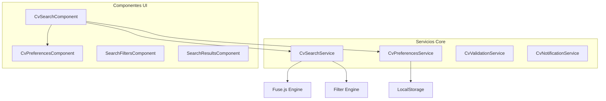

# 🔍 Sistema de Búsqueda Avanzada del CV

## 📋 Índice

1. [Visión General](#visión-general)
2. [Arquitectura del Sistema](#arquitectura-del-sistema)
3. [Servicios Principales](#servicios-principales)
4. [Componentes de UI](#componentes-de-ui)
5. [Funcionalidades Avanzadas](#funcionalidades-avanzadas)
6. [Configuración y Uso](#configuración-y-uso)
7. [Testing](#testing)
8. [Troubleshooting](#troubleshooting)

## 🎯 Visión General

El Sistema de Búsqueda Avanzada del CV es una solución completa que permite a los usuarios buscar, filtrar y gestionar información de currículums de manera eficiente y personalizable.

### Características Principales

- **Búsqueda Full-Text**: Utilizando Fuse.js para búsquedas inteligentes
- **Filtros Avanzados**: Múltiples criterios de filtrado combinables
- **Facetas Dinámicas**: Contadores automáticos de resultados por categoría
- **Persistencia de Preferencias**: Configuraciones guardadas en localStorage
- **Historial de Búsquedas**: Registro automático de búsquedas realizadas
- **Filtros Guardados**: Posibilidad de guardar y reutilizar configuraciones
- **Exportación de Resultados**: Múltiples formatos de exportación

## 🏗️ Arquitectura del Sistema



### Principios de Diseño

1. **Separación de Responsabilidades**: Cada servicio tiene una función específica
2. **Reactividad**: Uso de Signals y Observables para actualizaciones automáticas
3. **Persistencia**: Configuraciones guardadas automáticamente
4. **Extensibilidad**: Fácil adición de nuevos filtros y funcionalidades
5. **Performance**: Debouncing y optimizaciones para grandes volúmenes de datos

## 🔧 Servicios Principales

### CvSearchService

**Ubicación**: `src/app/core/services/cv/cv-search.service.ts`

Servicio principal para la gestión de búsquedas y filtros.

#### Funcionalidades Clave

```typescript
// Configuración de datos
updateExperiences(experiences: WorkExperience[]): void
updateEducation(education: EducationEntry[]): void

// Gestión de filtros
updateFilters(filters: Partial<AdvancedSearchFilters>): void
resetFilters(): void
getCurrentFilters(): AdvancedSearchFilters

// Búsqueda
quickSearch(term: string): Observable<SearchResults>
getSuggestions(term: string, type: string): string[]

// Facetas
getFacets(): SearchFacets

// Filtros guardados
saveCurrentFiltersAsPreset(name: string, description?: string): void
loadSavedFilter(filterId: string): void
```

#### Configuración de Búsqueda

```typescript
private readonly defaultConfig: SearchConfig = {
  threshold: 0.3,        // Umbral de similitud (0-1)
  includeScore: true,    // Incluir puntuación de relevancia
  includeMatches: true,  // Incluir coincidencias encontradas
  minMatchCharLength: 2, // Longitud mínima de coincidencia
  maxResults: 100        // Máximo de resultados
};
```

### CvPreferencesService

**Ubicación**: `src/app/core/services/cv/cv-preferences.service.ts`

Gestiona las preferencias del usuario y su persistencia.

#### Estructura de Preferencias

```typescript
interface CvPreferences {
  searchPreferences: {
    defaultSortBy: 'date' | 'relevance' | 'alphabetical' | 'duration';
    defaultSortOrder: 'asc' | 'desc';
    enableFuzzySearch: boolean;
    enableAutoComplete: boolean;
    saveSearchHistory: boolean;
    maxSearchHistoryItems: number;
  };
  
  displayPreferences: {
    itemsPerPage: number;
    showThumbnails: boolean;
    compactView: boolean;
    showFacets: boolean;
    defaultView: 'list' | 'grid' | 'timeline';
    enableAnimations: boolean;
  };
  
  exportPreferences: {
    defaultFormat: 'pdf' | 'docx' | 'html';
    includePhotos: boolean;
    includeReferences: boolean;
    templateStyle: 'modern' | 'classic' | 'minimal' | 'creative';
    paperSize: 'A4' | 'Letter';
    margins: 'normal' | 'narrow' | 'wide';
  };
  
  savedFilters: SavedFilter[];
  searchHistory: SearchHistoryItem[];
  privacySettings: PrivacySettings;
}
```

## 🎨 Componentes de UI

### CvSearchComponent

**Ubicación**: `src/app/features/perfil/components/cv/cv-search.component.ts`

Componente principal de la interfaz de búsqueda.

#### Funcionalidades

- Campo de búsqueda con autocompletado
- Panel de filtros avanzados
- Visualización de resultados
- Paginación
- Ordenamiento
- Exportación

#### Uso

```html
<app-cv-search
  [experiences]="experiences"
  [education]="education"
  (searchResults)="onSearchResults($event)"
  (filtersChanged)="onFiltersChanged($event)">
</app-cv-search>
```

### CvPreferencesComponent

**Ubicación**: `src/app/features/perfil/components/cv/cv-preferences.component.ts`

Interfaz para configurar preferencias del usuario.

#### Pestañas Disponibles

1. **Búsqueda**: Configuración de búsqueda por defecto
2. **Visualización**: Opciones de presentación
3. **Filtros Guardados**: Gestión de filtros personalizados
4. **Exportación**: Configuración de exportación
5. **Privacidad**: Configuración de datos y análisis

## ⚡ Funcionalidades Avanzadas

### 1. Filtros Inteligentes Combinados

```typescript
// Aplicar filtros inteligentes basados en contexto
applyCombinedFilters(filters: Partial<AdvancedSearchFilters>): void {
  const intelligentFilters = { ...filters };
  
  // Si se filtran tecnologías, cambiar ordenamiento a relevancia
  if (filters.technologies?.length > 0) {
    intelligentFilters.sortBy = 'relevance';
  }
  
  // Si se filtra por salario, ordenar por salario descendente
  if (filters.salaryRange) {
    intelligentFilters.sortBy = 'salary';
    intelligentFilters.sortOrder = 'desc';
  }
  
  this.updateFilters(intelligentFilters);
}
```

### 2. Presets de Fechas

```typescript
// Aplicar presets de fechas comunes
applyDatePreset(preset: DatePreset): void {
  const now = new Date();
  let from: Date;
  let to: Date = now;
  
  switch (preset) {
    case 'last_month':
      from = new Date(now.getFullYear(), now.getMonth() - 1, 1);
      break;
    case 'last_3_months':
      from = new Date(now.getFullYear(), now.getMonth() - 3, 1);
      break;
    case 'last_6_months':
      from = new Date(now.getFullYear(), now.getMonth() - 6, 1);
      break;
    case 'last_year':
      from = new Date(now.getFullYear() - 1, 0, 1);
      break;
  }
  
  this.updateFilters({
    dateRange: { from, to, preset }
  });
}
```

### 3. Facetas Dinámicas

Las facetas se actualizan automáticamente basándose en los filtros aplicados:

```typescript
getFacets(): SearchFacets {
  const experiences = this.experiencesSubject.value;
  const education = this.educationSubject.value;
  const currentFilters = this.getCurrentFilters();

  return {
    companies: this.buildFacet(
      experiences.map(exp => exp.company),
      currentFilters.companies
    ),
    technologies: this.buildFacet(
      experiences.flatMap(exp => exp.technologies || []),
      currentFilters.technologies
    ),
    // ... más facetas
  };
}
```

### 4. Historial de Búsquedas

```typescript
addToSearchHistory(
  searchTerm: string, 
  filters: Partial<AdvancedSearchFilters>, 
  resultCount: number
): void {
  if (!this.preferences().searchPreferences.saveSearchHistory) {
    return;
  }

  const newItem: SearchHistoryItem = {
    id: this.generateId(),
    searchTerm,
    filters,
    timestamp: new Date(),
    resultCount
  };

  // Evitar duplicados y limitar tamaño
  const currentHistory = this.preferences().searchHistory;
  const maxItems = this.preferences().searchPreferences.maxSearchHistoryItems;
  
  const filteredHistory = currentHistory.filter(item => 
    item.searchTerm !== searchTerm || 
    JSON.stringify(item.filters) !== JSON.stringify(filters)
  );

  const updatedHistory = [newItem, ...filteredHistory].slice(0, maxItems);
  
  this.updatePreferences({ searchHistory: updatedHistory });
}
```

## ⚙️ Configuración y Uso

### Instalación de Dependencias

```bash
npm install fuse.js
npm install @types/fuse.js --save-dev
```

### Configuración en el Módulo

```typescript
import { CvSearchService } from '@core/services/cv/cv-search.service';
import { CvPreferencesService } from '@core/services/cv/cv-preferences.service';

@NgModule({
  providers: [
    CvSearchService,
    CvPreferencesService,
    // ... otros servicios
  ]
})
export class CvModule { }
```

### Uso Básico

```typescript
@Component({
  selector: 'app-cv-page',
  template: `
    <app-cv-search
      [experiences]="experiences"
      [education]="education"
      (searchResults)="handleSearchResults($event)">
    </app-cv-search>
  `
})
export class CvPageComponent {
  experiences = signal<WorkExperience[]>([]);
  education = signal<EducationEntry[]>([]);

  constructor(
    private searchService: CvSearchService,
    private preferencesService: CvPreferencesService
  ) {}

  ngOnInit() {
    // Aplicar preferencias por defecto
    this.searchService.applyDefaultSearchPreferences();
    
    // Cargar datos
    this.loadCvData();
  }

  handleSearchResults(results: SearchResults) {
    console.log('Resultados de búsqueda:', results);
  }
}
```

## 🧪 Testing

### Tests Unitarios

Los tests están ubicados en:
- `cv-search.service.spec.ts`
- `cv-preferences.service.spec.ts`
- `cv-search.component.spec.ts`

### Ejecutar Tests

```bash
# Tests específicos del CV
node scripts/run-cv-tests.js unit

# Tests de componentes
node scripts/run-cv-tests.js component

# Todos los tests
node scripts/run-cv-tests.js all
```

### Tests de Integración

```bash
# Tests E2E con Cypress
npx cypress run --spec "cypress/e2e/cv/**/*.cy.ts"
```

## 🔧 Troubleshooting

### Problemas Comunes

#### 1. Búsqueda Lenta

**Síntoma**: La búsqueda tarda mucho en responder

**Solución**:
```typescript
// Ajustar configuración de Fuse.js
private readonly defaultConfig: SearchConfig = {
  threshold: 0.4,        // Aumentar umbral
  maxResults: 50,        // Reducir máximo de resultados
  minMatchCharLength: 3  // Aumentar longitud mínima
};
```

#### 2. Facetas No Se Actualizan

**Síntoma**: Los contadores de facetas no cambian

**Solución**:
```typescript
// Verificar que se llame a getFacets() después de updateFilters()
this.updateFilters(newFilters);
const facets = this.getFacets(); // Esto debe ejecutarse
```

#### 3. Preferencias No Se Guardan

**Síntoma**: Las configuraciones se pierden al recargar

**Solución**:
```typescript
// Verificar que localStorage esté disponible
if (typeof Storage !== 'undefined') {
  // localStorage está disponible
} else {
  // Fallback para entornos sin localStorage
  console.warn('localStorage no disponible');
}
```

### Logs de Debug

```typescript
// Habilitar logs detallados
localStorage.setItem('cv-search-debug', 'true');

// En el servicio
private debug(message: string, data?: any) {
  if (localStorage.getItem('cv-search-debug') === 'true') {
    console.log(`[CvSearchService] ${message}`, data);
  }
}
```

### Performance Monitoring

```typescript
// Medir tiempo de búsqueda
private searchExperiences(experiences: WorkExperience[], filters: AdvancedSearchFilters) {
  const startTime = performance.now();
  
  // ... lógica de búsqueda
  
  const endTime = performance.now();
  this.debug(`Búsqueda completada en ${endTime - startTime}ms`);
  
  return results;
}
```

## 📚 Referencias

- [Fuse.js Documentation](https://fusejs.io/)
- [Angular Signals Guide](https://angular.io/guide/signals)
- [RxJS Operators](https://rxjs.dev/guide/operators)
- [Angular Testing Guide](https://angular.io/guide/testing)

---

**Versión**: 1.0.0  
**Última Actualización**: 2025-06-21  
**Autor**: Augment Agent
