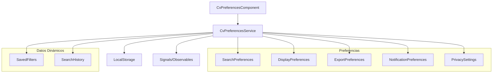

# ⚙️ Sistema de Preferencias del CV

## 📋 Índice

1. [Visión General](#visión-general)
2. [Arquitectura](#arquitectura)
3. [Estructura de Datos](#estructura-de-datos)
4. [API del Servicio](#api-del-servicio)
5. [Componente de UI](#componente-de-ui)
6. [Persistencia](#persistencia)
7. [Migración de Datos](#migración-de-datos)
8. [Mejores Prácticas](#mejores-prácticas)
 
## 🎯 Visión General

El Sistema de Preferencias del CV permite a los usuarios personalizar completamente su experiencia de búsqueda, visualización y exportación de currículums. Todas las configuraciones se persisten automáticamente en localStorage y se sincronizan en tiempo real.

### Características Principales

- **Persistencia Automática**: Configuraciones guardadas en localStorage
- **Reactividad**: Actualizaciones en tiempo real usando Signals
- **Migración de Versiones**: Compatibilidad con versiones anteriores
- **Exportación/Importación**: Backup y restauración de configuraciones
- **Validación**: Verificación de integridad de datos
- **Configuración por Defecto**: Valores sensatos predeterminados

## 🏗️ Arquitectura



### Principios de Diseño

1. **Reactividad**: Uso de Signals para actualizaciones automáticas
2. **Inmutabilidad**: Actualizaciones inmutables de estado
3. **Persistencia Transparente**: Guardado automático sin intervención del usuario
4. **Validación**: Verificación de datos en carga y guardado
5. **Extensibilidad**: Fácil adición de nuevas preferencias

## 📊 Estructura de Datos

### Interfaz Principal

```typescript
interface CvPreferences {
  searchPreferences: SearchPreferences;
  displayPreferences: DisplayPreferences;
  exportPreferences: ExportPreferences;
  notificationPreferences: NotificationPreferences;
  savedFilters: SavedFilter[];
  searchHistory: SearchHistoryItem[];
  privacySettings: PrivacySettings;
}
```

### Preferencias de Búsqueda

```typescript
interface SearchPreferences {
  defaultSortBy: 'date' | 'relevance' | 'alphabetical' | 'duration' | 'grade' | 'salary';
  defaultSortOrder: 'asc' | 'desc';
  enableFuzzySearch: boolean;
  enableAutoComplete: boolean;
  saveSearchHistory: boolean;
  maxSearchHistoryItems: number;
}
```

### Preferencias de Visualización

```typescript
interface DisplayPreferences {
  itemsPerPage: number;
  showThumbnails: boolean;
  compactView: boolean;
  showFacets: boolean;
  defaultView: 'list' | 'grid' | 'timeline';
  enableAnimations: boolean;
}
```

### Preferencias de Exportación

```typescript
interface ExportPreferences {
  defaultFormat: 'pdf' | 'docx' | 'html';
  includePhotos: boolean;
  includeReferences: boolean;
  templateStyle: 'modern' | 'classic' | 'minimal' | 'creative';
  paperSize: 'A4' | 'Letter';
  margins: 'normal' | 'narrow' | 'wide';
}
```

### Filtros Guardados

```typescript
interface SavedFilter {
  id: string;
  name: string;
  description?: string;
  filters: AdvancedSearchFilters;
  createdAt: Date;
  lastUsed?: Date;
  useCount: number;
  isDefault?: boolean;
}
```

### Historial de Búsquedas

```typescript
interface SearchHistoryItem {
  id: string;
  searchTerm: string;
  filters: Partial<AdvancedSearchFilters>;
  timestamp: Date;
  resultCount: number;
}
```

## 🔧 API del Servicio

### CvPreferencesService

**Ubicación**: `src/app/core/services/cv/cv-preferences.service.ts`

#### Métodos Principales

```typescript
class CvPreferencesService {
  // Signals reactivos
  readonly preferences = signal<CvPreferences>(defaultPreferences);
  readonly searchPreferences = computed(() => this.preferences().searchPreferences);
  readonly displayPreferences = computed(() => this.preferences().displayPreferences);
  
  // Observables para compatibilidad
  readonly preferences$ = this.preferencesSubject.asObservable();
  
  // Actualización de preferencias
  updateSearchPreferences(preferences: Partial<SearchPreferences>): void;
  updateDisplayPreferences(preferences: Partial<DisplayPreferences>): void;
  updateExportPreferences(preferences: Partial<ExportPreferences>): void;
  updateNotificationPreferences(preferences: Partial<NotificationPreferences>): void;
  
  // Gestión de filtros guardados
  saveFilter(name: string, filters: AdvancedSearchFilters, description?: string): SavedFilter;
  deleteFilter(filterId: string): void;
  updateFilter(filterId: string, updates: Partial<SavedFilter>): void;
  markFilterAsUsed(filterId: string): void;
  
  // Historial de búsquedas
  addToSearchHistory(searchTerm: string, filters: Partial<AdvancedSearchFilters>, resultCount: number): void;
  clearSearchHistory(): void;
  
  // Exportación/Importación
  exportPreferences(): string;
  importPreferences(jsonData: string): boolean;
  
  // Reset
  resetToDefaults(): void;
}
```

#### Uso Básico

```typescript
@Component({...})
export class MyComponent {
  constructor(private preferencesService: CvPreferencesService) {}
  
  ngOnInit() {
    // Acceso reactivo a preferencias
    effect(() => {
      const searchPrefs = this.preferencesService.searchPreferences();
      console.log('Preferencias de búsqueda:', searchPrefs);
    });
    
    // Actualizar preferencias
    this.preferencesService.updateSearchPreferences({
      defaultSortBy: 'relevance',
      enableFuzzySearch: false
    });
  }
}
```

### Computed Signals

```typescript
// Acceso directo a secciones específicas
const searchPrefs = this.preferencesService.searchPreferences();
const displayPrefs = this.preferencesService.displayPreferences();
const savedFilters = this.preferencesService.savedFilters();
const searchHistory = this.preferencesService.searchHistory();
```

## 🎨 Componente de UI

### CvPreferencesComponent

**Ubicación**: `src/app/features/perfil/components/cv/cv-preferences.component.ts`

#### Estructura de Pestañas

```typescript
readonly tabs = [
  { id: 'search', label: 'Búsqueda', icon: 'search' },
  { id: 'display', label: 'Visualización', icon: 'visibility' },
  { id: 'filters', label: 'Filtros Guardados', icon: 'filter_list' },
  { id: 'export', label: 'Exportación', icon: 'download' },
  { id: 'privacy', label: 'Privacidad', icon: 'security' }
];
```

#### Formularios Reactivos

```typescript
// Formulario de preferencias de búsqueda
this.searchForm = this.fb.group({
  defaultSortBy: [preferences.searchPreferences.defaultSortBy],
  defaultSortOrder: [preferences.searchPreferences.defaultSortOrder],
  enableFuzzySearch: [preferences.searchPreferences.enableFuzzySearch],
  enableAutoComplete: [preferences.searchPreferences.enableAutoComplete],
  saveSearchHistory: [preferences.searchPreferences.saveSearchHistory],
  maxSearchHistoryItems: [preferences.searchPreferences.maxSearchHistoryItems]
});
```

#### Auto-guardado

```typescript
private setupAutoSave(): void {
  this.searchForm.valueChanges.subscribe(() => {
    if (this.privacyForm.get('autoSaveEnabled')?.value) {
      this.preferencesService.updateSearchPreferences(this.searchForm.value);
    }
  });
}
```

### Uso del Componente

```html
<app-cv-preferences
  (preferencesChanged)="onPreferencesChanged($event)"
  (filterSaved)="onFilterSaved($event)">
</app-cv-preferences>
```

## 💾 Persistencia

### Estructura de Almacenamiento

```typescript
// Clave de localStorage
private readonly STORAGE_KEY = 'mpd-cv-preferences';
private readonly STORAGE_VERSION = '1.0.0';

// Estructura guardada
interface StoredData {
  version: string;
  preferences: CvPreferences;
  lastSaved: string;
}
```

### Guardado Automático

```typescript
private savePreferences(): void {
  try {
    const data: StoredData = {
      version: this.STORAGE_VERSION,
      preferences: this.preferences(),
      lastSaved: new Date().toISOString()
    };
    
    localStorage.setItem(this.STORAGE_KEY, JSON.stringify(data));
  } catch (error) {
    console.error('Error saving CV preferences:', error);
  }
}
```

### Carga de Preferencias

```typescript
private loadPreferences(): void {
  try {
    const stored = localStorage.getItem(this.STORAGE_KEY);
    if (stored) {
      const data: StoredData = JSON.parse(stored);
      
      if (data.version === this.STORAGE_VERSION) {
        const preferences = { ...this.getDefaultPreferences(), ...data.preferences };
        this.preferencesSignal.set(preferences);
      } else {
        this.migratePreferences(data);
      }
    }
  } catch (error) {
    console.error('Error loading CV preferences:', error);
    this.resetToDefaults();
  }
}
```

## 🔄 Migración de Datos

### Sistema de Versiones

```typescript
private migratePreferences(oldData: any): void {
  console.log(`Migrating preferences from version ${oldData.version || 'unknown'}`);
  
  switch (oldData.version) {
    case '0.9.0':
      this.migrateFrom090(oldData);
      break;
    case undefined:
      this.migrateFromLegacy(oldData);
      break;
    default:
      console.warn('Unknown version, resetting to defaults');
      this.resetToDefaults();
  }
}
```

### Migración Específica

```typescript
private migrateFrom090(oldData: any): void {
  const migratedPreferences: CvPreferences = {
    ...this.getDefaultPreferences(),
    
    // Migrar preferencias existentes
    searchPreferences: {
      ...this.getDefaultPreferences().searchPreferences,
      defaultSortBy: oldData.sortBy || 'date',
      enableFuzzySearch: oldData.fuzzySearch ?? true
    },
    
    // Migrar filtros guardados
    savedFilters: (oldData.savedFilters || []).map((filter: any) => ({
      ...filter,
      id: filter.id || this.generateId(),
      createdAt: new Date(filter.createdAt || Date.now()),
      useCount: filter.useCount || 0
    }))
  };
  
  this.preferencesSignal.set(migratedPreferences);
  this.savePreferences();
}
```

## 📋 Mejores Prácticas

### 1. Actualización de Preferencias

```typescript
// ✅ Correcto - Actualización inmutable
updateSearchPreferences(updates: Partial<SearchPreferences>): void {
  const current = this.preferences();
  const updated = {
    ...current,
    searchPreferences: { ...current.searchPreferences, ...updates }
  };
  
  this.preferencesSignal.set(updated);
  this.savePreferences();
}

// ❌ Incorrecto - Mutación directa
updateSearchPreferences(updates: Partial<SearchPreferences>): void {
  this.preferences().searchPreferences = { ...this.preferences().searchPreferences, ...updates };
}
```

### 2. Manejo de Errores

```typescript
private savePreferences(): void {
  try {
    const data = {
      version: this.STORAGE_VERSION,
      preferences: this.preferences(),
      lastSaved: new Date().toISOString()
    };
    
    localStorage.setItem(this.STORAGE_KEY, JSON.stringify(data));
  } catch (error) {
    if (error.name === 'QuotaExceededError') {
      console.warn('localStorage quota exceeded, clearing old data');
      this.clearOldData();
      this.savePreferences(); // Reintentar
    } else {
      console.error('Error saving preferences:', error);
    }
  }
}
```

### 3. Validación de Datos

```typescript
private validatePreferences(preferences: any): boolean {
  // Validar estructura básica
  if (!preferences || typeof preferences !== 'object') {
    return false;
  }
  
  // Validar preferencias de búsqueda
  if (preferences.searchPreferences) {
    const validSortOptions = ['date', 'relevance', 'alphabetical', 'duration'];
    if (!validSortOptions.includes(preferences.searchPreferences.defaultSortBy)) {
      return false;
    }
  }
  
  return true;
}
```

### 4. Performance

```typescript
// Debounce para auto-guardado
private setupAutoSave(): void {
  effect(() => {
    const preferences = this.preferences();
    
    // Debounce el guardado para evitar escrituras excesivas
    if (this.saveTimeout) {
      clearTimeout(this.saveTimeout);
    }
    
    this.saveTimeout = setTimeout(() => {
      this.savePreferences();
    }, 500);
  });
}
```

### 5. Testing

```typescript
describe('CvPreferencesService', () => {
  let service: CvPreferencesService;
  let mockLocalStorage: { [key: string]: string };

  beforeEach(() => {
    // Mock localStorage
    mockLocalStorage = {};
    spyOn(localStorage, 'getItem').and.callFake(key => mockLocalStorage[key] || null);
    spyOn(localStorage, 'setItem').and.callFake((key, value) => mockLocalStorage[key] = value);
    
    service = new CvPreferencesService();
  });

  it('should save preferences to localStorage', () => {
    service.updateSearchPreferences({ defaultSortBy: 'relevance' });
    
    expect(localStorage.setItem).toHaveBeenCalledWith(
      'mpd-cv-preferences',
      jasmine.any(String)
    );
  });
});
```

## 🔍 Debugging

### Logs de Debug

```typescript
// Habilitar logs detallados
localStorage.setItem('cv-preferences-debug', 'true');

private debug(message: string, data?: any): void {
  if (localStorage.getItem('cv-preferences-debug') === 'true') {
    console.log(`[CvPreferencesService] ${message}`, data);
  }
}
```

### Inspección de Estado

```typescript
// Método para debugging
getDebugInfo(): any {
  return {
    preferences: this.preferences(),
    storageKey: this.STORAGE_KEY,
    version: this.STORAGE_VERSION,
    storageSize: JSON.stringify(this.preferences()).length,
    lastSaved: localStorage.getItem(this.STORAGE_KEY + '_lastSaved')
  };
}
```

---

**Versión**: 1.0.0  
**Última Actualización**: 2025-06-21  
**Autor**: Augment Agent
